# How I built a perfect GTA San Andreas map with my own engine

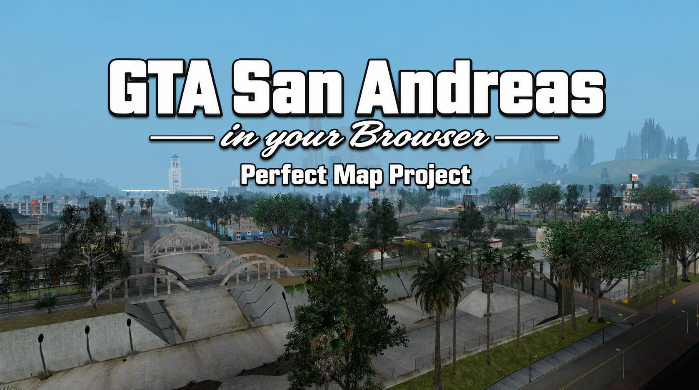

This is a follow-up to my article on building an engine compatible with GTA San Andreas that runs in the browser — I'd recommend reading [that one](https://github.com/AlexSergey/opensa/blob/main/blog/1-i-ran-gta-san-andreas-on-my-own-engine-in-the-browser-solo-with-claude-in-3-weeks.md) first. Here I'll cover how I prepared a perfect map and fixed the game's legacy bugs.

> **What this is — and what it isn't.** OpenSA is an **experiment** and a learning project. The goal is the
> _engine_: a browser-based runtime built to be **compatible with the RenderWare formats** that GTA San
> Andreas uses — **not** to clone the game or redistribute it. It ships **no game assets**; you bring your
> own legitimate copy (or a community mod). Think of it as an alternative way to _run_ a game you already
> own, in the browser. GTA San Andreas, its assets and trademarks belong to Rockstar Games / Take-Two — this
> is an unofficial, non-commercial fan project.

---

If you can't be bothered to read — here are the important links right away:

- [Previous article](https://github.com/AlexSergey/opensa/blob/main/blog/1-i-ran-gta-san-andreas-on-my-own-engine-in-the-browser-solo-with-claude-in-3-weeks.md)
- [Repo](https://github.com/AlexSergey/opensa)
- [Trailer](https://www.youtube.com/watch?v=pdplknPkhAQ)

## Why bother?

The original GTA San Andreas came out way back in 2004. I remember it like yesterday — it was September, I'd just started university, and after classes I went and bought the DVD. It even had that legendary botched localization, «Потрачено» (the infamous Russian mistranslation of "Wasted"). At the time it was an unprecedentedly big game — a whole DVD, around 4.5 GB of data unpacked.

A game that size was, of course, riddled with bugs from day one. Back then there was no fast internet to download big game patches, so Rockstar officially shipped just one patch — it fixed infrastructure issues, but patching the map itself was impossible.

Impossible, that is, until a huge community took it on.

GTA is famous for the sheer volume of fan mods that have come out for it and keep coming — from huge ones that rebuild whole cities and change the entire concept, down to tiny fixes.

One team of enthusiasts pulled together a stack of good map-fix mods, spent several years hand-fixing every object in the game, and released a big mod:

[SA Proper Fixes (MixMods)](https://www.mixmods.com.br/2026/06/sa-proper-fixes/)

It tries to fix every known bug found (there are hundreds, if not thousands). We'll get to the bugs later — but here's why I decided not to use it for my project:

First, it's a fairly closed project, shipped as an all-in-one mod. We can technically extend it, but doing so is quite hard.

Second, it works with the original assets, and many of them are dated — the original trees and vegetation, for example, look really bad.

I wanted custom assets from the start.

Third, the authors never got back to me.

So I decided not to depend on third-party mods and to build my own.

## The problems to fix

Before getting to the implementation, let me first lay out the problems I wanted to fix.

The original map has several classes of big, fundamental bugs:

Broken models. Some models in the game are broken (stray or unwelded polygons) and can have duplicate polygons — which can cause z-fighting: up close, the player sees flickering surfaces, sharp edges standing out, and so on.

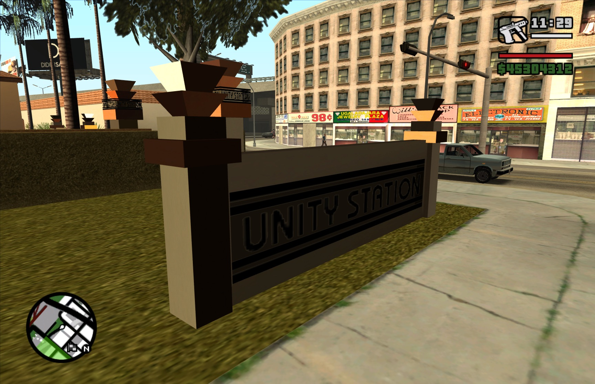

Broken normals. The original game doesn't work with real lighting — it only emulates it via Prelight and Night Vertex colors — so for the original this isn't a problem, but for my custom renderer in the browser it's not just a problem, it's a blocker.

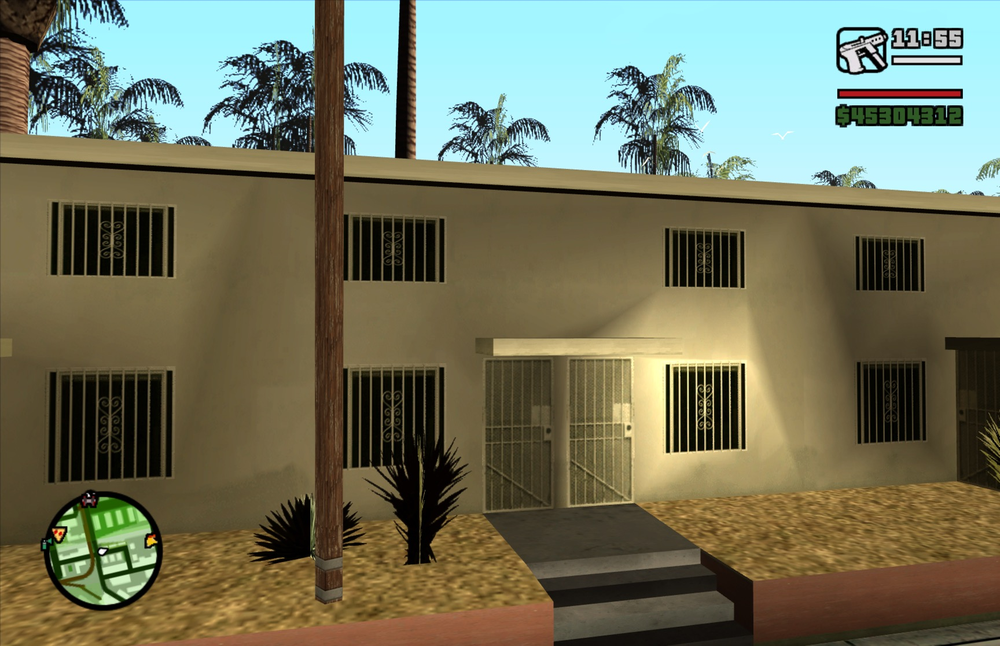

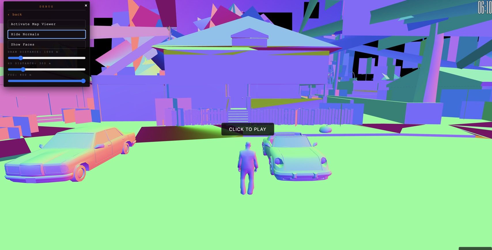

Holes in the map. Many objects join badly and have visible gaps.

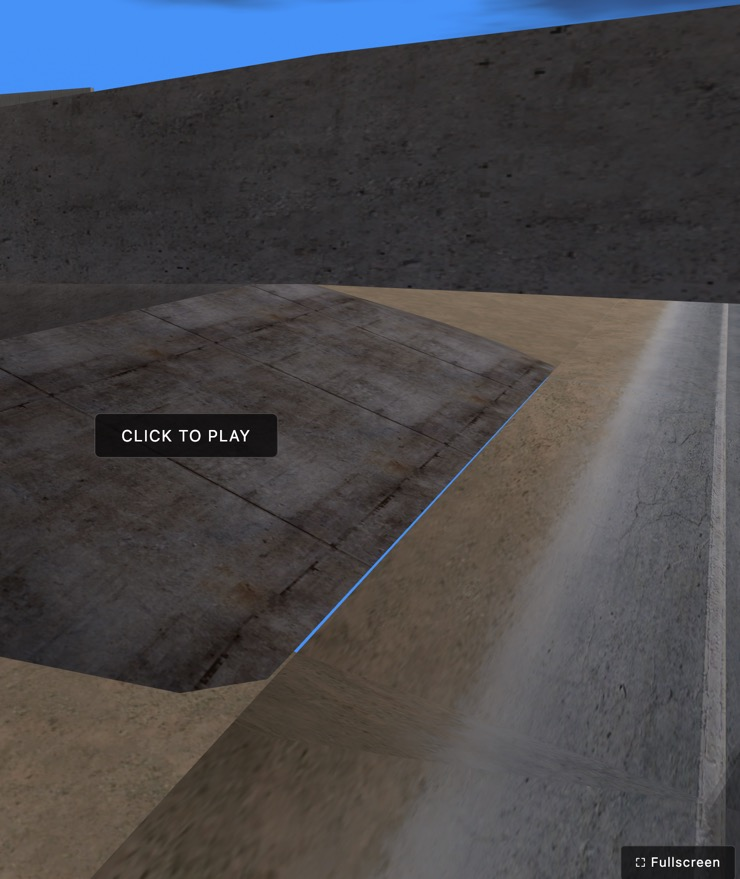

Prelight. One of the most obvious problems. What is prelight? It's lighting baked into a model's texture (effectively the model's shading), and many original objects look either far darker than everything around them or, the other way around, glow in the dark.

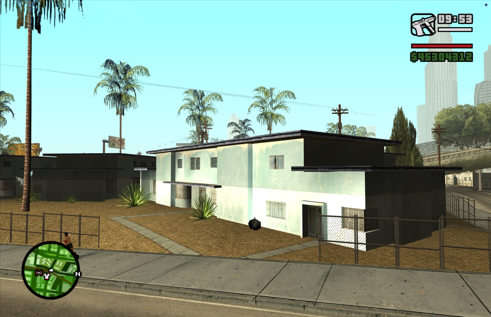

And many more.

I also had personal gripes with some of the original behaviour:

The tree, bush and other models are dated. I wanted to use modern mods like BSOR for vegetation. The problem was that the trees have no LOD level, so as the player drives, a tree can pop up right in your face.

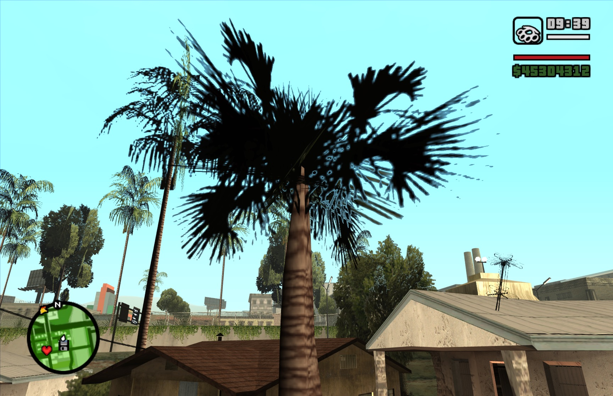

Draw distance in the game is awful overall — the original uses an approach where every building, surface and road has its own low-poly copy. The game doesn't always manage to load the HD model before the player sees this horror up close. These LOD models don't match the original, so the player can fall right through them.

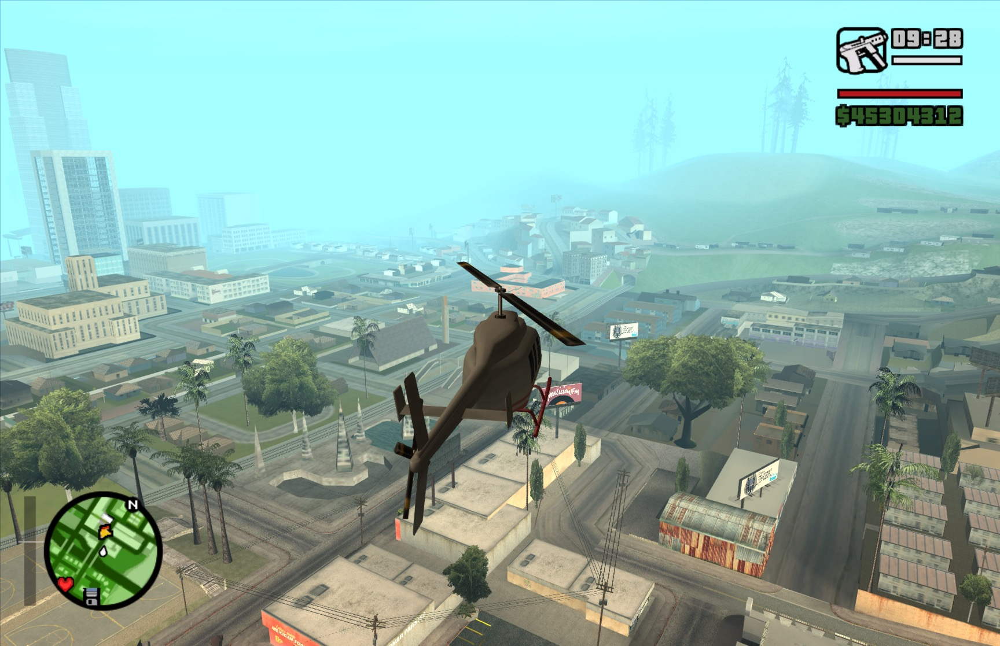

Draw distance for small objects, like rocks and such.

Streaming — sometimes the game can't render objects in time, especially high-quality ones.

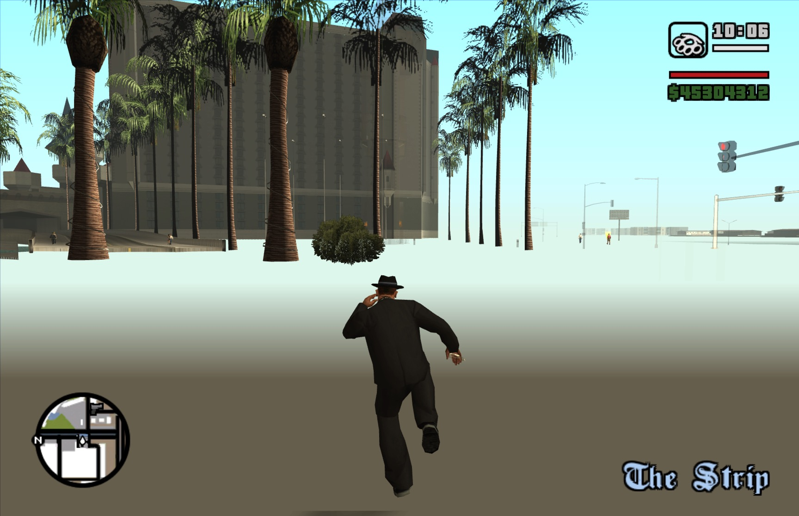

In short, the scope of work was clear. It called for massive edits to thousands of map objects — so the idea of a pipeline came to me right away.

## The pipeline concept

For each of the problems above I decided to build a separate tool — independent and self-contained.

All of them follow a unix style: you feed a game in, you get a modified game out.

These pipelines chain together.

The architecture of this solution looked something like this at first:

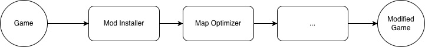

It would change later, but more on that below.

## Implementation

### Mod-installer

Building a perfect map in 2026 without using mods is a crime! A huge number of very different mods have come out for GTA San Andreas, including ones that fix and extend the original map without breaking the game's overall feel — which is exactly what we want.

But my engine didn't yet have a mechanism for layering mods on top of the base map.

A quick aside: there are two ways to install mods — the legacy approach, where we patch the game's resources by "baking" the mod straight into the sources, and the more advanced one via modloader, where the mod is installed into a separate folder and mixed into the game at launch.

The modloader approach fit my engine architecture very nicely — I wrote about it in detail [here](https://github.com/AlexSergey/opensa/blob/main/blog/1-i-ran-gta-san-andreas-on-my-own-engine-in-the-browser-solo-with-claude-in-3-weeks.md#optimization). All I had to do was add an extra module between the assets loader and the VFS.

But I also needed the legacy approach — I'll explain why later.

This tool grew into a huge mod-management plant; it can now bake mods straight into the engine, which improves performance, strips unused files, and so on.

### Map-optimizer

The most interesting part. Once we've baked the mods into the game and mod-installer has handed us the patched resources, we can fully load the map into map-optimizer, analyze prelight against all neighbouring map objects, retune it, fix geometry, fill holes, and so on.

Since this is a big automated job, manual review is essential. For that I built a separate tool that loads a model before and after processing so we can validate that everything's fine.

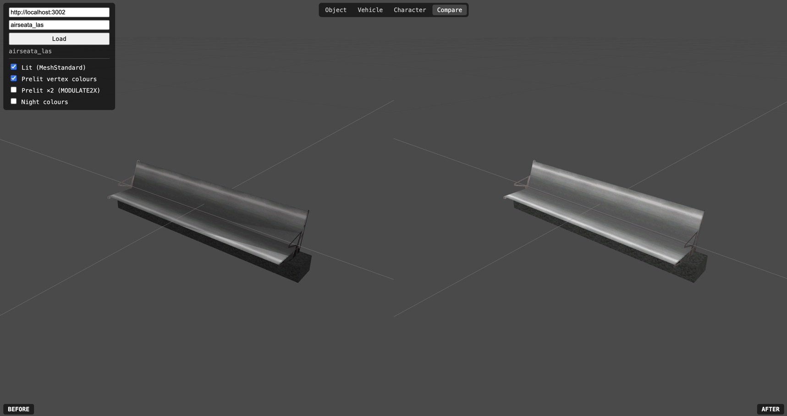

This tool has a plugin architecture, and I extended it with 20 plugins that do a full cleanup of every model in the game, a full prelight retune, and auto-fix other bugs. I also added an override: if the result is wrong for particular cases, you can pass parameters by hand, which is very handy.

### lod-trees-generator

After fully processing the map through map-optimizer, we mix in whichever vegetation-replacement mod we like.

I took the very popular BSOR mod.

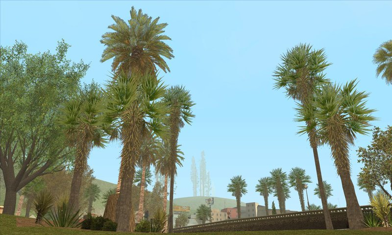

Like all similar mods, it has no LOD objects — meaning the trees don't render at a distance. This tool's job was to add that, and I also added transferring prelight from the original trees onto the modded ones, so the trees blend nicely into the game's overall look.

The algorithm is pretty simple:

Take the tree model.

Render it to a texture from 4 sides:

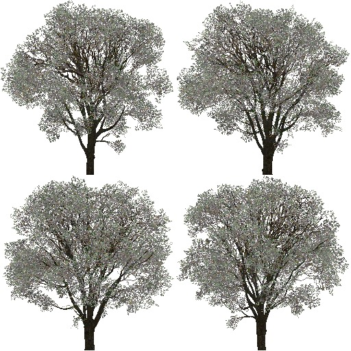

Take the dimensions of the source tree:

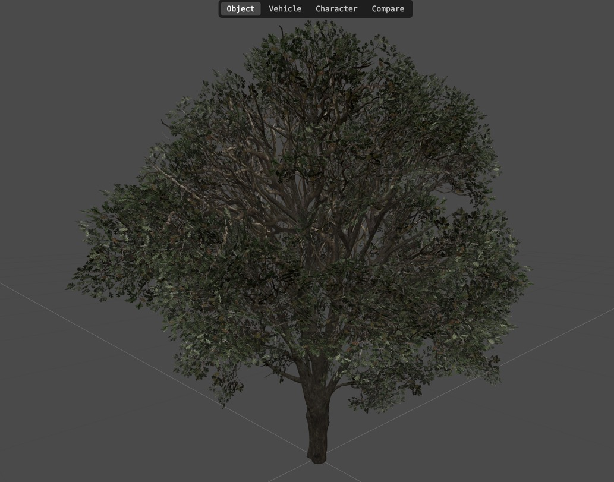

Build 6 crossed planes from those dimensions:

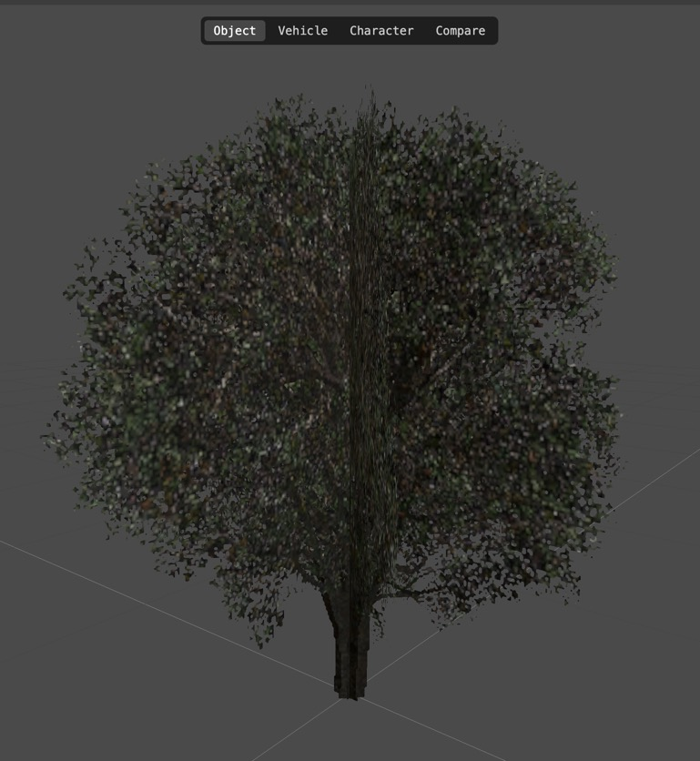

You get a simplified copy of the original, but a thousand times cheaper.

Now the tool's job is to place them around the map and make GTA draw them.

At this stage we got nice, realistic vegetation.

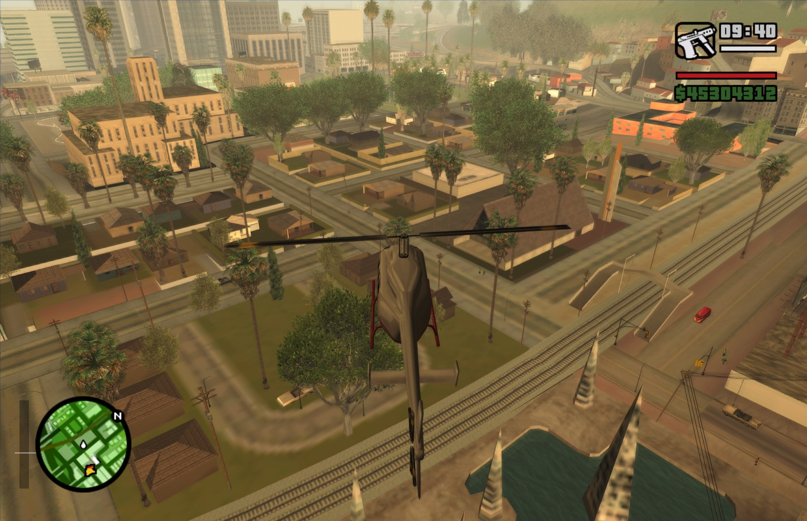

As you can see, the trees are in place and the draw distance is up. In the screenshot there's still a problem with the map's own LODs. Moving on.

### lod-procobj

procobj are all the small objects — bushes, rocks. In the original game the mechanic was this: the player walks into, say, a forest (a forest is a zone where procobj is generated), and within a 50-meter radius bushes, rocks and branches spawn. That generation makes LOD objects impossible for them, and it looks extremely odd in play — you walk up and objects start rapidly drawing in front of you.

My engine already generated this kind of object in the right zones.

All that was left was to use the tool to strip the live generation out of the game's streaming and place the models at the right positions. The process is more or less the same as in lod-trees.

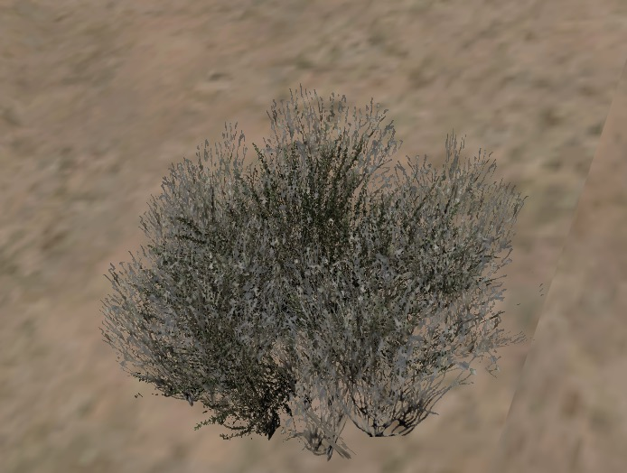

I could have left this tool out of the write-up entirely, if not for one interesting bug:

After I generated the LODs for procobj, I was flying over the map in the real game and ran into a strange anomaly.

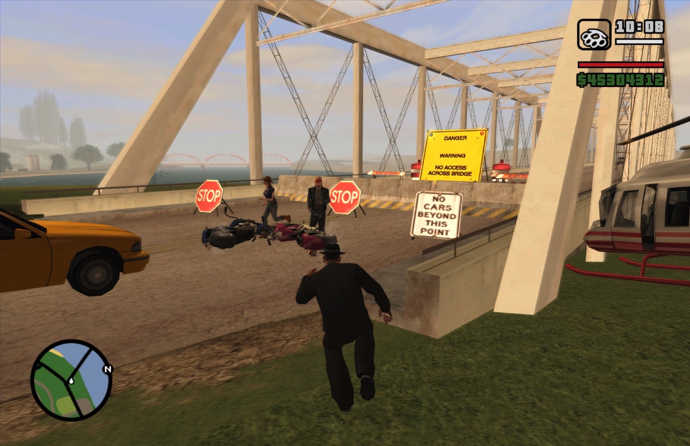

In one spot on the map a mysterious barrier appeared on a bridge. It's supposed to be there — but only at the very start of the game, whereas my save has the game already 100% completed.

So Opus and I started digging… for a long, long time, trying different options. And then Anthropic released Fable.

To spare you all the fixes we tried with Fable, the short version: the investigation took a day and a half. It turned out that because there are so many small objects, we hit one of the game's limits — the game started to warp and anomalies appeared.

For now this isn't fully fixed; I just lowered the generation density.

### lod-generator

lod-generator is a tool that generates higher-quality LOD objects for the game, so there's no "blur" in the graphics.

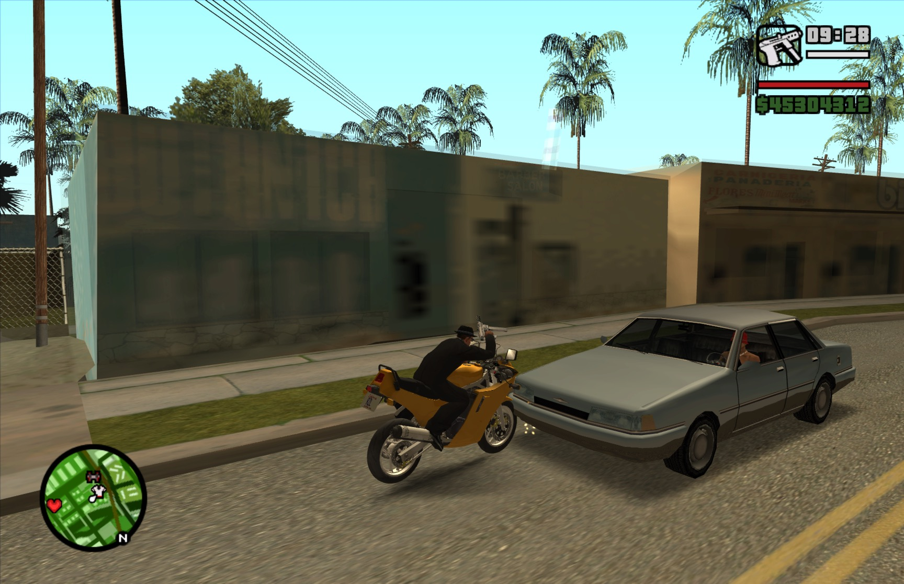

Up to this tool, everything before it generated the map in full compatibility with the original game.

But since I built a more advanced rendering system in my engine — you can read about it [here](https://github.com/AlexSergey/opensa/blob/main/blog/1-i-ran-gta-san-andreas-on-my-own-engine-in-the-browser-solo-with-claude-in-3-weeks.md#rendering) —

I had to create two different LOD-generation tools:

- sa-lod-generator
- opensa-lod-generator

The difference is that the original game has one LOD object per HD object.

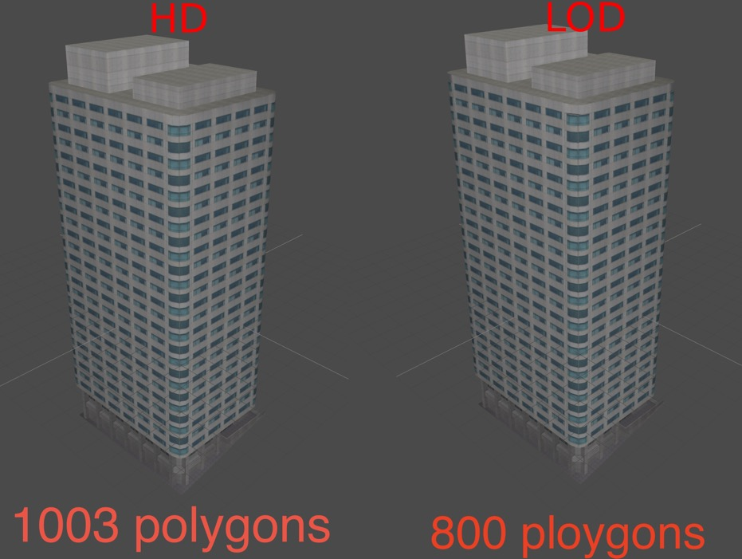

In OpenSA I have composite LODs — one big LOD per district, which avoids object-loading problems altogether.

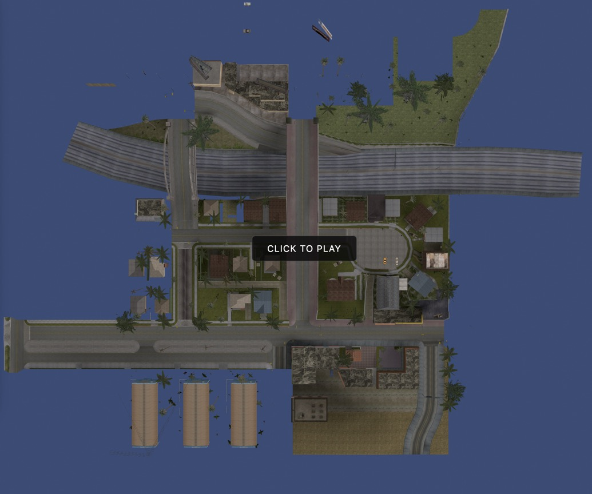

How the LOD-generation algorithm works:

At first I tried simply decimating the mesh:

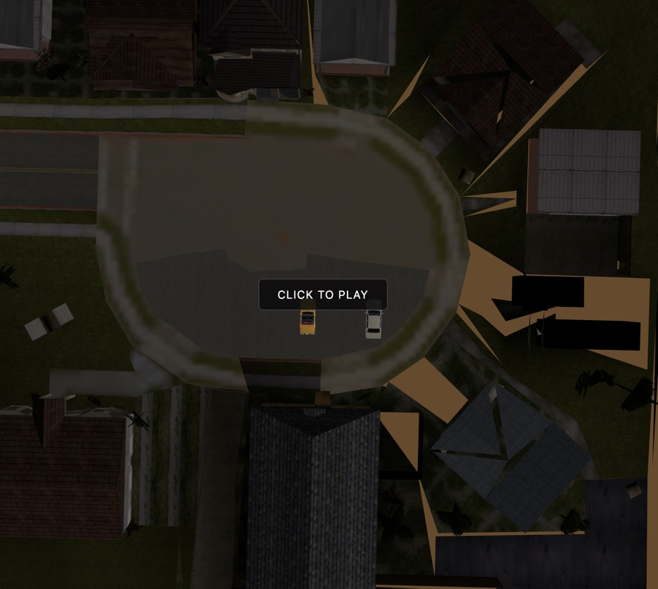

but that led to broken models, holes in surfaces, and so on.

Some results were downright horrifying:

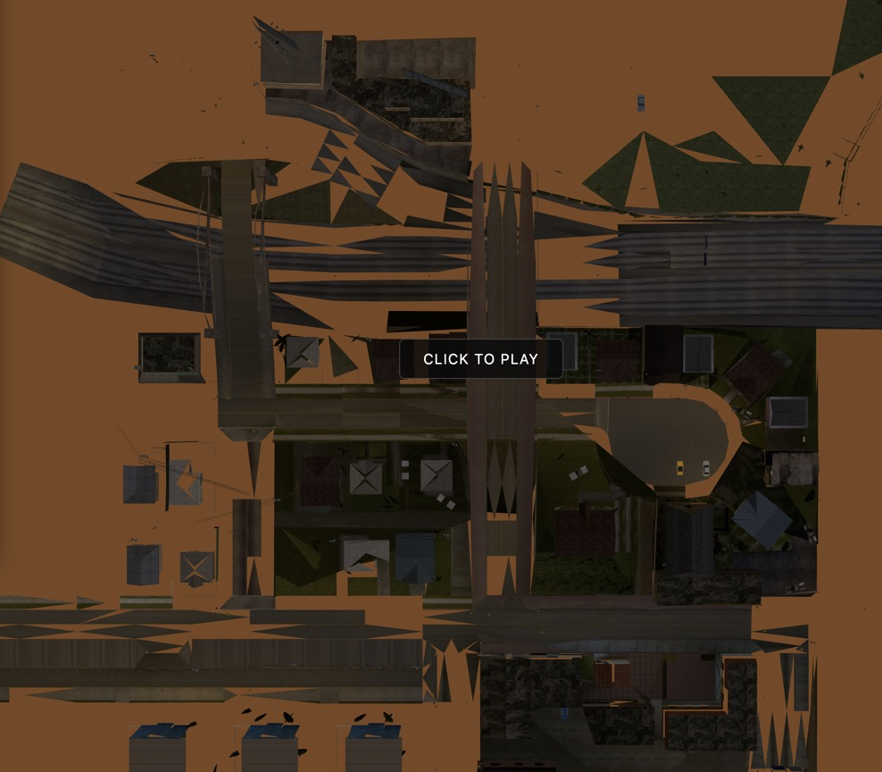

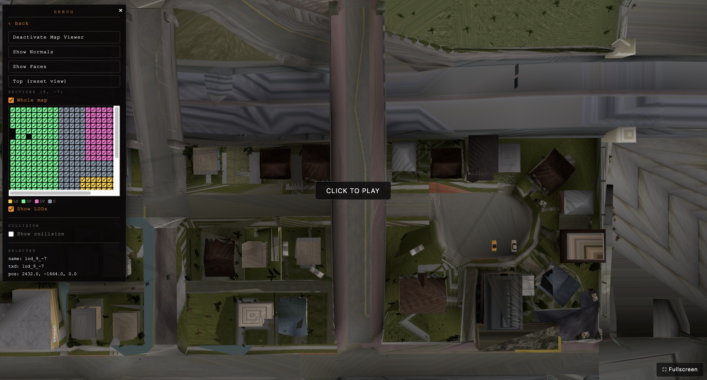

What I ended up with: the whole map is loaded, and 10 "cameras" are created — plain sources that shoot rays at the model we're generating a LOD for. If a ray doesn't hit any polygons, they're invisible from that angle and can be removed.

That gives an almost identical model, like in the screenshot above, but 20% smaller by dropping all the details invisible from a distance.

For OpenSA these models are then merged into a district. This is where the two approaches now diverge.

LOD generation and merging is the longest, most resource-heavy operation. On my MacBook Pro M3 it takes about 10–15 minutes on 6 threads.

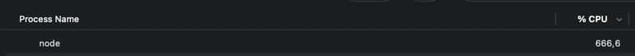

### perfect-map-builder

This is an orchestrator that runs all the tools in the chain in sequence.

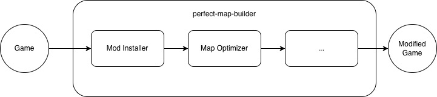

This is what the project's architecture looks like right now. It assembles one of the most optimized maps you can get.

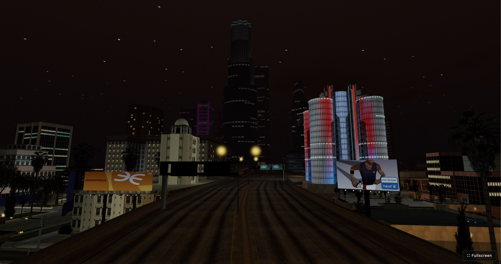

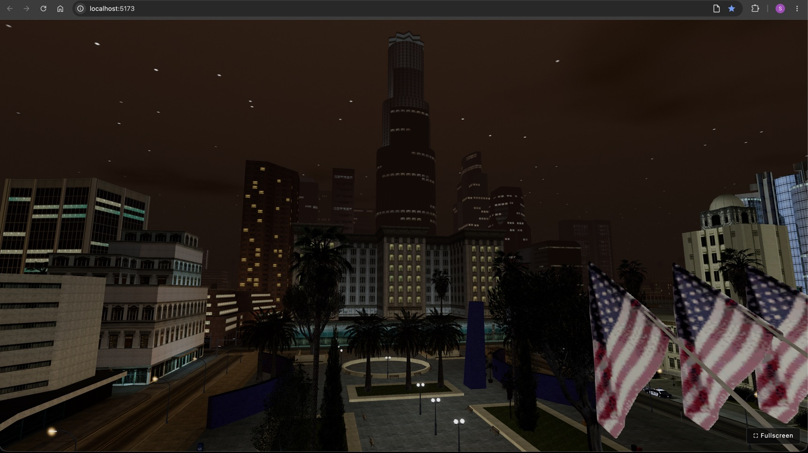

And here's a video of the result:

This isn't the final stage yet — it still needs manual testing and tuning — but the result is already great.

## The streaming problem in OpenSA

Since the map got significantly heavier because of the mods and hi-poly LODs, the game started to drop frames.

So a completely new streaming system was built:

When the game has loaded and the player has spawned at the given coordinates, we build a grid of hi-poly cells with a LOD border around them, as described [here](https://github.com/AlexSergey/opensa/blob/main/blog/1-i-ran-gta-san-andreas-on-my-own-engine-in-the-browser-solo-with-claude-in-3-weeks.md#rendering).

The player starts moving — the game casts a ray in that direction — and cells within view radius load. Since the cells are heavy, they're warmed up in a 1px hidden canvas.

To swap cells between LOD ⇄ HD, a worker is used so the main thread isn't blocked. This is a very simplified description; it's actually more involved, and I don't want to bog you down.

The result: even with a hi-poly map, the game runs without performance drops.

## Working with Fable

Over the course of building all these tools I ran into a huge number of bugs and problems. This last week I worked only with Fable, since Opus performed worse. Fable behaves like a real developer: while hunting a bug, it immediately suggests simplifications to pin down the line between "bug" and "no bug," so it's clear what caused it.

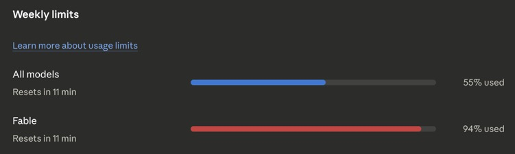

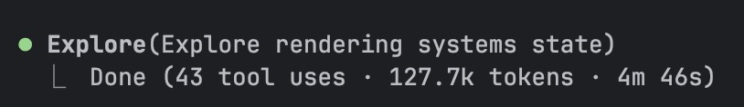

Token usage is incredibly high, but the quality of the result is many times better.

In this iteration I built these tools with the following workflow:

- Create a branch locally.
- First build a prototype of the tool; if I can do what I planned, I move it into the clean version.
- Each tool has its own plan broken into iterations and its own documentation, which keeps them from getting mixed up with the engine code.

In the main planning branch I introduced the concept of open-issues, which lets me track unresolved problems there and jot down what we tried, what worked, and what didn't.

I also introduced the concept of ideas — future plans set aside for later.

## What's next

At this stage I have a clean map to keep working with. Normals are fixed, there are no double faces, smoothed groups are set up — which makes it possible to start writing the new, progressive renderer.

The next step: I want to try making graphics at the level of modern AAA games, but in the browser. We'll see what comes of it. Or doesn't. Either way, we'll see.

Thanks, everyone, for reading!
