# Architecture

The map of OpenSA, split by concern. Start here, then drill into the flow you care about:

| Doc                                                | What it covers                                                                                        |
| -------------------------------------------------- | ----------------------------------------------------------------------------------------------------- |
| [boot-and-loading.md](./boot-and-loading.md)       | How a game gets into the browser: menu → loader (fetch / local folder / http-dir) → VFS → world-ready |
| [world-streaming.md](./world-streaming.md)         | The native formats (`.osm` / `.ostex` / `.oscell` / `.oswire` / `.ospak`) and how the engine streams the world |
| [perfect-map-builder.md](./perfect-map-builder.md) | The offline build pipeline that produces the canonical build (`./build/original`)                      |
| [cleo-scripts.md](./cleo-scripts.md)               | Compiled CLEO `.cs` mods on our own SCM VM: decoder → runner → host facets, the native-address atlas, tiers/tracer/F2 |
| [tools.md](./tools.md)                             | One-paragraph architecture of every tool in `tools/` and `tools-debug/`                               |

Diagrams live in [assets/](./assets/) and are **generated** — `npm run arch:render` refreshes them all
(`scripts/arch-graph.ts` derives the package graphs from real imports and renders every named
`%%| <name>` mermaid block in this folder to `assets/<name>.svg`). Edit the mermaid source in the doc,
re-render, commit both.

## Repository layout

OpenSA is an **Nx + npm-workspaces monorepo** (see [plan 057](../plans/057-nx-monorepo-migration/readme.md)). Every
package keeps only `package.json` (+ `readme`/`docs`) at its root and **all code lives in `<pkg>/src/`**.
Cross-package imports go through the `@opensa/*` package name (subpath `exports` → `.ts`, no build step),
never deep relative paths.

```
apps/
  web/         @opensa/web         React shell + game surface + game-config + controls-harness  (tag type:app)
  viewer/      @opensa/viewer      object/vehicle/character/compare viewer tabs in /viewer.html  (type:app)
  engine-lab/  @opensa/engine-lab  the renderer proving ground (isolated engine scenes)          (type:app)
  sa-map-viewer/ @opensa/sa-map-viewer  the map inspector fed by a FOLDER of original SA files   (type:app)
  dispatch/    @opensa/dispatch    CAD console over the streamed map (engine + streaming only)   (type:app)
packages/                          (tag type:engine)
  engine/         @opensa/engine          the WebGPU renderer — device/pipelines, frame graph, world cells
  engine-formats/ @opensa/engine-formats  native .osm/.ostex/.oscell/.ospak/.oswire layouts, shared with tools
  cell-weld/      @opensa/cell-weld       RW instances + TXDs → .oscell/.ostex bytes (weld, texture plan, alpha)
  math/           @opensa/math            dependency-free 3D math
  renderware/     @opensa/renderware      parsers (DFF/TXD/COL, IDE/IPL/DAT/GXT) + archive + map + mesh prep
  game/           @opensa/game            ECS, systems, adapters — renderer-agnostic
  loaders/        @opensa/loaders         asset loaders (fetch / local folder / http-dir) — framework-agnostic
  vfs/            @opensa/vfs             unzip → AssetFileSystem
  game-build/     @opensa/game-build      partitioning shared by the loaders + build scripts
tools/                             (tag type:tool — offline; may read engine packages, never the app)
  perfect-map-builder/ · opensa-pack/ · fetch-pack/ · mod-installer/ · vehicle-installer/ · ped-installer/
  map-optimizer/ · opensa-lod-generator/ · sa-lod-generator/ · lod-trees-generator/ · sa-procobj-placement/
  vehicle-optimizer/ · timecyc-builder/ · lod-common/ · map-placement/ · rw-codec/ · tool-kit/
tools-debug/  bench-harness/ (headless field checks) · sa-int16-repro/ (ghost-barriers repro dial)
asi/          sdk/ (the asi:: framework + codegen every .asi plugin builds on) · perfect-map/ (its first
              consumer: the real-SA limit-adjuster ASI)
cleo/         sdk/ (author CLEO scripts in TS → standard .cs) · scripts/ (our authored script sources)
root: game-src/ · mods-src/ · build/ · static/ · tests/ · e2e/ · scripts/ · deploy/ · nx.json · *.html
```

**Module boundaries** are enforced in lint by `@nx/enforce-module-boundaries` via `package.json` `nx.tags`:
`type:app` → app + engine; `type:engine` → engine only (never app/tools); `type:tool` → engine + tools.

## Runtime dependency graph

Generated from actual `@opensa/*` imports (apps + packages only):



The full graph including every tool is [assets/packages.svg](./assets/packages.svg) — wide, use it as a
reference when touching tool dependencies.

## Rules of the road

- **`AssetFileSystem`** (defined in `renderware/archive`) is the seam: the game reads files through it and
  doesn't care whether the **vfs** filled up from fetched chunks, a picked folder, or a served dir.
- Only **`game/adapters`** (and `game/mods`) may import **renderware** — it's the leaf layer.
- **loaders** and **vfs** are standalone (no React, no game).
- The engine / Rapier load **lazily** with the game surface, so the UI shell paints instantly.
- **Two cell grids:** the render grid (`CELL_SIZE = 250` — opensa-pack weld, engine streaming, AND the
  cell-LOD bake, which must match it so an object's HD and LOD share a slot; field-proven in plan 087)
  and the game grid (`256`, collision streaming / procobj scatter only).

> Runtime in one line: **source (chunks | folder | served dir) → loader → vfs (AssetFileSystem) → game ←
> renderware → engine (WebGPU) + Rapier**, with the world itself streamed from the build's `opensa/` pak —
> all behind an instant React shell.
