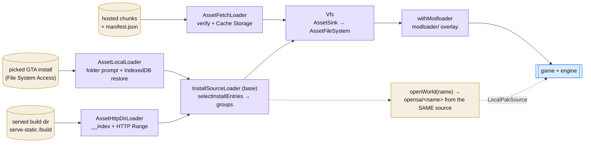
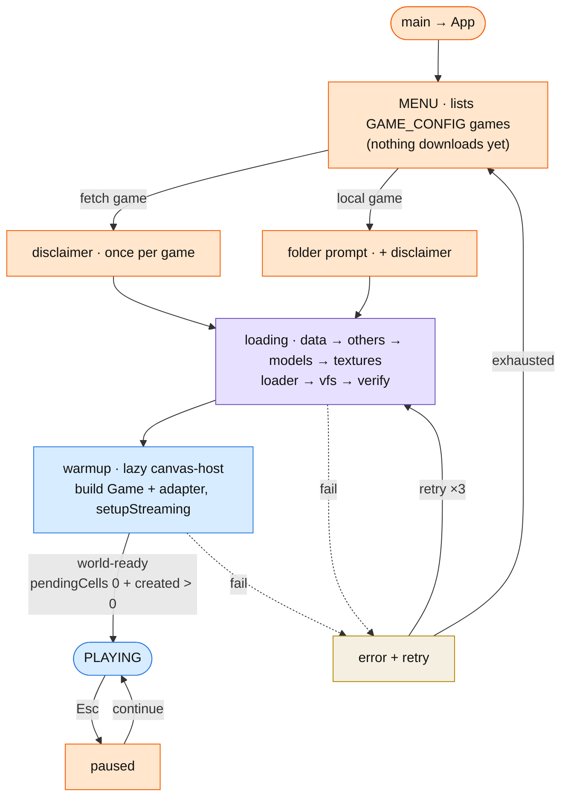

# Boot & asset loading

How a game gets from a source (hosted chunks, a picked GTA install, or a served build dir) into a running
world. Feature detail: [features/asset-loader.md](../features/asset-loader.md),
[features/ui-shell.md](../features/ui-shell.md).

## The three loaders, one VFS

`createAssetLoader` (`packages/loaders/src/index.ts`) picks the loader from the game's config
(`GAME_CONFIG[game].assetLoader`) or the dev override `?loader=http-dir&src=<url>`:

| Kind       | Class                | Source                                                      | Caches?                                         |
| ---------- | -------------------- | ----------------------------------------------------------- | ----------------------------------------------- |
| `fetch`    | `AssetFetchLoader`   | hosted chunk archives + `manifest.json`                     | Cache Storage, keyed by build                   |
| `local`    | `AssetLocalLoader`   | user-picked GTA install (File System Access, Chromium-only) | no — reads the disk every boot                  |
| `http-dir` | `AssetHttpDirLoader` | a **served** game dir (`serve-static` mounts `./build`)     | no — dev surfaces read the canonical build live |

All three fill the same `Vfs` (`packages/vfs`) through the `AssetSink` interface (`addChunk` unzips fetch
chunks via fflate; `addFiles` ingests raw files), and `Vfs` implements `AssetFileSystem` — everything
downstream is loader-agnostic. After loading, `withModloader` (`packages/modloader`) wraps the VFS with the
`modloader/` overlay (merges `vehicles.ide` / `handling.cfg` / `carcols.dat` / `gta.dat`, serves mod assets
by bare name).

diagram source

### Fetch loader (`asset-fetch-loader/`)

- `init()` fetches `manifest.json` with `cache: 'no-store'`; a failed manifest fetch/parse **wipes the whole
  cache bucket** and rethrows — that's build revocation. Stale cached chunks are evicted (`staleKeys`).
- `load()` downloads with a concurrency limit (4): the never-cached `data` group goes **first** as a
  build-liveness probe, then the cacheable groups — so a revoke wipe stays atomic.
- Every chunk is verified (byte length always, SHA-1 12-hex prefix when the manifest carries one) before it
  reaches the sink. Cache Storage degrades to a silent no-op in insecure contexts (plain `http://` LAN).

### Install-source loaders (`asset-local-loader/`)

`InstallSourceLoader` is the shared base (plan 079); subclasses differ only in `resolveSource()`:

- **`AssetLocalLoader`** — `prepare()` shows the folder prompt inside the Play-click gesture, `restore()`
  re-opens a remembered folder from IndexedDB without a gesture. Source = `browserInstallSource(dir)`.
- **`AssetHttpDirLoader`** — `fetchDirIndex(base)` GETs `${base}/__index` (served by `scripts/serve-static.ts`'s
  `/build` mount), archives are read lazily over **HTTP Range** (`urlRangeSource`).

Both assemble the same `InstallSource` (`install-source-core.ts`): `models/gta3.img` is required (throws if
absent), every other `models/*.img` merges as one lazy override layer (`gta_int.img` first, then mod archives
such as `lods.img`). `selectInstallEntries` ports the build-script selection: IPL-placed models, **every**
ped and vehicle from `peds.ide`/`vehicles.ide`, procobj clutter, loose files, and the world pak.

### The pak-source rule (plan 079)

**The loading mode selects the world.** If the loader has `openWorld`, boot passes a `LocalPakSource` to the
engine and the world pak is read as `opensa/<name>` **from the picked/served install**; a missing file returns
`null` and streaming fails loudly. Only fetch mode (no `openWorld`) falls back to the hosted
`/${?src ?? 'pak-map'}` URL. There is no `public/` fallback in folder/http-dir mode — that silent shadow is
exactly the bug 079 removed.

## Boot flow (`apps/web`)

`boot-machine.ts` is a pure reducer over `BootPhase`
(`menu → disclaimer/folder → loading → warmup → playing ⇄ paused`, `error` + 3 retries). Nothing downloads
until a game is picked. `use-asset-boot.ts` owns the session (`loader + vfs`), runs
`init → load → vfs.verify` per attempt, and exposes `pakSource` + progress. `EngineCanvasHost` lazily builds
the engine, calls `setupStreaming(engine, pakSource, { lodRadius })`, and fires `WORLD_READY` once streaming
settles (`pendingCells === 0 && created > 0`, or a timeout backstop).

diagram source

### Version guard

`opensa-pack` stamps `buildTime` into the pak's `manifest.json`; `setupStreaming` surfaces it and the F2
debugger shows it as a grey `build HH:mm DD-MM-YYYY` line — every dev surface displays which build it is
actually reading. If two surfaces disagree, one of them is not on the canonical build.
