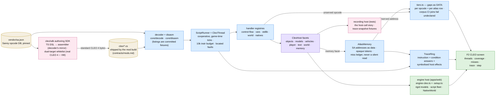

# CLEO scripts — the SCM VM and its host

How a compiled CLEO `.cs` mod runs in OpenSA (plan chain
[`097-cleo-basic`](../plans/097-cleo-basic/readme.md)): decode against the vendored Sanny opcode DB,
execute on a cooperative VM that knows nothing about the engine, and reach the world only through an
injected host interface — native memory access included, served by a symbolised address atlas rather
than byte emulation. The module flows-and-files map is `packages/cleo/README.md`; this doc is the
architecture picture.

Diagram

The boundaries that make it hold:

- **The VM never sees the engine.** Everything a script can touch is a `CleoHost` facet
  (`host.interface.ts`); the engine implements the facets over its real seams
  (`engine-cleo-setup.ts`), tests implement one recording mock whose call log doubles as the
  committed trace-snapshot fixtures. Time comes in as a delta — no wall clock in the core.
- **Native memory is named, or it is a report.** `AtlasMemory` resolves reads/writes/calls through
  opaque tokens and an address table cited from gta-reversed; an address it cannot NAME lands in
  the miss ledger and answers a defined default — never a silent wrong read, never a raw address
  in a log line.
- **A gap is data, not a crash.** Unimplemented opcodes and unserved atlas rows carry a declared
  tier (`noop` / `conditional-false` / `kill-thread`); the corpus CI joins fail on an undeclared
  gap and on a declared row with no real consumer. The F2 screen shows the same ledger live; the
  tracer replays the story per thread with every conditional's answer.
- **Scripts ship through the normal build** — installers carry `cleo/`, boot discovers
  `cleo/*.cs` in the VFS (capped by `config.cleo.maxScripts`), and `?cleo=1` /
  `Config.cleo.enabled` gate the whole system down to a single branch when off.
- **Our own scripts are authored, not hand-compiled** — the `cleo/sdk` subproject
  (`@opensa/cleo-sdk`, plan chain [`cleo/sdk/docs/`](../../cleo/sdk/docs/architecture.md)) compiles
  a typed TS DSL to the SAME standard `.cs` bytes off the same vendored DB; the decoder referees
  every artifact (corpus re-encode byte-identical), and the dual-target whitelist keeps an emitted
  script runnable under plain real CLEO 4 unless its NAME says `opensa-only`.
