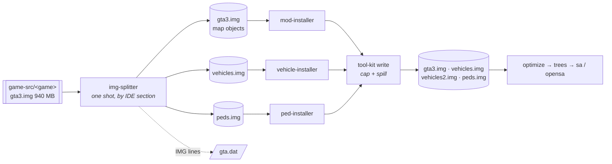

# IMG archive layout — typed buckets, bounded files

**Status: DESIGNED, not built.** The rule and the ownership below are decided; the tool that produces the
layout is `tools/img-splitter` and its chain is
[plan 001](../../tools/img-splitter/docs/plans/001-archive-split.md). This doc is what that plan implements,
and what any later tool touching `models/*.img` has to keep true.

## Why the layout exists

One archive that content is allowed to grow into stops working, and it stops working in the middle of a
build. Measured 2026-08-15 on the original's shipping mod set:

| | |
| --- | --- |
| `gta3.img` after the `mods` stage | 1 242 236 928 B |
| mod vehicle payload | 3 077 354 628 B (752 dff/txd in 212 folders) |
| `gta3.img` after `vehicles` | **4 268 185 600 B** |
| what a reader then gets | `ERR_FS_FILE_TOO_LARGE File size (4268185600) is greater than 2 GiB` |

Node reads a file into one buffer and refuses past 2 GiB, while the positional write path has no such
ceiling — so a stage can emit an archive that every stage after it fails to open, and nothing warns at the
moment it happens ([edge case](../edge-cases/converter-pipeline.md),
[restriction](../restrictions/assets-and-data.md)).

This is a HOST limit, not the game's and not the format's: VER2 addresses entries in uint32 sectors and has
room for terabytes. It is also not a limit to design content down to — the mod set is the content, and
`docs/project-goals.md` directive 2 is explicit that a container's ceiling is a reason to change the
container.

## The layout

**Type decides the OWNER of an archive. Size decides how many files that owner gets.**

```
models/
  gta3.img         map objects — objs / tobj / anim, and everything no IDE claims
  vehicles.img     cars — the `cars` IDE section, model + its txd
  vehicles2.img    …and its spill siblings, created by the WRITER when a cap is crossed
  peds.img         peds — the `peds` IDE section
  cutscene.img     unchanged: the cutscene fleet already has its own archive
  player.img       unchanged
  gta_int.img      unchanged
```

Two halves, and they belong to different code:

- **The splitter** (`tools/img-splitter`) runs ONCE, on the stock tree, before anything installs. It only
  distributes what is already there and writes the `IMG` lines into `gta.dat`. It does not bound anything —
  the stock archives are nowhere near the ceiling (`gta3.img` is 940 064 768 B).
- **The shared writer** (`tool-kit`) carries the cap and the spill, because that is where growth happens.
  `vehicles.img` crosses the ceiling while `vehicle-installer` is adding the 212th car, not while the
  splitter is running. Every installer routes its write through it, so no tool can grow a file past what a
  reader takes.

Splitting by type ALONE bounds nothing — the vehicle bucket is 3.08 GB by itself. Bounding by size alone
loses the ownership that makes each stage cheap. The layout needs both axes.

## Why the split is BEFORE mod-installer

Not for size. For **name uniqueness**.

After an early split every entry name lives in exactly one archive, so a mod replacing `admiral.dff`
replaces it inside `vehicles.img` — by name, exactly as it replaces it inside `gta3.img` today.

Split late and a stock car sits in `gta3.img` while its replacement lands in `vehicles.img`. What the game
loads when one name exists in two registered archives is **unknown**, and if precedence turns out to be
"first registered", the mod silently does not apply: the build succeeds, the file is present, and the stock
car is in the world. Nothing catches that.

The early split does not answer the precedence question. It never asks it — and that is the point.

## The flow



## What the classifier reads

The bucket comes from **authored data, never from a name list in our code** — the rule in
[`restrictions/assets-and-data.md`](../restrictions/assets-and-data.md). Each IDE row declares both a model
and its txd, and the SECTION it sits in is the answer. Measured in the stock `data/` tree:

| Section | Rows | Bucket |
| --- | --- | --- |
| `objs` | 14 052 | map |
| `tobj` | 160 | map |
| `anim` | 54 | map |
| `peds` | 276 | peds |
| `cars` | 212 | vehicles |
| `weap` | 50 | map (no separate bucket earns its keep at this size) |
| `hier` | 35 | already lives in `cutscene.img` |

`gta3.img` also carries entries no IDE declares at all — 16 316 entries of which 12 964 `.dff`, 2 759
`.txd`, 216 `.col`, 164 `.ipl`, 149 `.ifp`, 64 `.dat`. Anything unclaimed stays in `gta3.img` and is
**named** by the tool rather than silently dumped: a growing unclaimed list is how a classifier goes wrong
quietly.

## What this does NOT change

- **The id pools are global, not per-archive.** `checkImgIdBudgets` counts `.txd` / `.col` / `.ipl` entries
  across every archive against the FLA pools; distributing the same entries over more files spends exactly
  the same ids. What it must learn is the new archive NAMES — it hard-codes four today
  (`perfect-map-builder/src/pipeline.ts`), and an archive it does not know about is an under-count, which is
  the silent direction.
- **The VER2 per-entry ceiling** (~128 MB, u16 sectors) is untouched and still guarded.
- **The opensa target.** Our engine packs its own formats; the split changes the shape of its INPUT and
  nothing about the pak.

## The open question, and where it gets answered

SA registers archives in a fixed-size table. **How many slots it has must be read out of the exe or
gta-reversed, not remembered** — the game already runs six (`gta3`, `gta_int`, `player`, `cutscene`,
`carrec`, `script`) and this layout adds more. If the table is too small, the lift is ASI work, and
[`restrictions/sa-target.md`](../restrictions/sa-target.md) requires exactly ONE plugin to own a given limit —
so whether FLA already moves it is part of the same question. The field run in plan 001 is what decides
whether any of that is needed.
