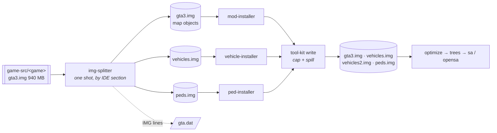

# IMG archive layout — typed buckets, bounded files

**Status: BUILT and FIELD-ACCEPTED (2026-08-15).** `tools/img-splitter` produces the layout, `tool-kit` carries
the cap and the spill, pmb runs the split as its first stage, and the user's field runs launched and played a
split build with no adjuster work at all — then confirmed three swept cutscene scenes on it, which is the
sharper test: every one of their texture parents now resolves out of `vehicles2.img`. This doc is what
[plan 001](../../tools/img-splitter/docs/plans/001-archive-split.md) implements, and what any later tool
touching `models/*.img` has to keep true.

**What ships today is the stock-fitting shape**: `splitBuckets` defaults to `['vehicles']`, so peds and
weapons stay in `gta3.img` and the two free archive slots go to `vehicles.img` and its one spill sibling —
8 of 8, zero headroom. **That is why the field run needed no ASI**: not a lifted ceiling, an unreached one.
The full four-bucket layout below is what the lift would unlock, and it is described here rather than
deferred because the classifier already produces it —
[`in-reserve/img-archive-limit-lift.md`](../in-reserve/img-archive-limit-lift.md) holds the deferred task
and the condition that starts it.

## Why the layout exists

One archive that content is allowed to grow into stops working, and it stops working in the middle of a
build. Measured 2026-08-15 on the original's shipping mod set:

| | |
| --- | --- |
| `gta3.img` after the `mods` stage | 1 242 236 928 B |
| mod vehicle payload | 3 077 354 628 B (752 dff/txd in 212 folders) |
| `gta3.img` after `vehicles` | **4 268 185 600 B** |
| what a reader then gets | `ERR_FS_FILE_TOO_LARGE File size (4268185600) is greater than 2 GiB` |

Node reads a file into one buffer and refuses past 2 GiB, while the positional write path has no such
ceiling — so a stage can emit an archive that every stage after it fails to open, and nothing warns at the
moment it happens ([edge case](../edge-cases/converter-pipeline.md),
[restriction](../restrictions/assets-and-data.md)).

This is a HOST limit, not the game's and not the format's: VER2 addresses entries in uint32 sectors and has
room for terabytes. It is also not a limit to design content down to — the mod set is the content, and
`docs/project-goals.md` directive 2 is explicit that a container's ceiling is a reason to change the
container.

## The layout

**Type decides the OWNER of an archive. Size decides how many files that owner gets.**

```
models/
  gta3.img         map objects — objs / tobj / anim / hier, and everything no IDE claims
  vehicles.img     cars — the `cars` IDE section, PLUS the mod-shop parts carmods.dat names
  vehicles2.img    …and its spill siblings, created by the WRITER when a cap is crossed
  peds.img         peds — the `peds` IDE section
  weapons.img      weapons — the `weap` IDE section
  cutscene.img     unchanged: the cutscene fleet already has its own archive
  player.img       unchanged
  gta_int.img      unchanged
```

Two halves, and they belong to different code:

- **The splitter** (`tools/img-splitter`) runs ONCE, on the stock tree, before anything installs. It only
  distributes what is already there and writes the `IMG` lines into `gta.dat`. It does not bound anything —
  the stock archives are nowhere near the ceiling (`gta3.img` is 940 064 768 B).
- **The shared writer** (`tool-kit`) carries the cap and the spill, because that is where growth happens.
  `vehicles.img` crosses the ceiling while `vehicle-installer` is adding the 212th car, not while the
  splitter is running. Every installer routes its write through it, so no tool can grow a file past what a
  reader takes.

Splitting by type ALONE bounds nothing — the vehicle bucket is 3.08 GB by itself. Bounding by size alone
loses the ownership that makes each stage cheap. The layout needs both axes.

**What each bucket weighs** — stock measured by the classifier (2026-08-15), installed projected from the
shipping mod set:

| Bucket | Stock entries | Stock bytes | + mods | ≈ installed |
| --- | --- | --- | --- | --- |
| map | 15 073 | 832.1 MB | 1 145 532 416 | **~1.98 GB — at the wall** |
| vehicles | 613 | 50.5 MB | 3 077 354 628 | **~3.1 GB — two files** |
| peds | 530 | 55.6 MB | 3 006 464 | 58 MB |
| weapons | 100 | 1.3 MB | — | 1.3 MB |

So the vehicle bucket is not the only one that spills; the map bucket lands within 8 % of the ceiling with
the mod set we ship today, which is another way of saying the cap has to be a WRITER's rule rather than a
layout decision taken once.

## Why the split is BEFORE mod-installer

Not for size. For **name uniqueness**.

After an early split every entry name lives in exactly one archive, so a mod replacing `admiral.dff`
replaces it inside `vehicles.img` — by name, exactly as it replaces it inside `gta3.img` today.

Split late and a stock car sits in `gta3.img` while its replacement lands in `vehicles.img`. What the game
loads when one name exists in two registered archives is **unknown**, and if precedence turns out to be
"first registered", the mod silently does not apply: the build succeeds, the file is present, and the stock
car is in the world. Nothing catches that.

The early split does not answer the precedence question. It never asks it — and that is the point.

## The flow



## What the classifier reads

The bucket comes from **authored data, never from a name list in our code** — the rule in
[`restrictions/assets-and-data.md`](../restrictions/assets-and-data.md). Each IDE row declares both a model
and its txd, and the SECTION it sits in is the answer. Measured in the stock `data/` tree:

| Section | Rows | Bucket |
| --- | --- | --- |
| `objs` | 14 052 | map — **except** a model `carmods.dat` names as a mod-shop part, which is a vehicle |
| `tobj` | 160 | map |
| `anim` | 54 | map |
| `peds` | 276 | peds |
| `cars` | 212 | vehicles |
| `weap` | 50 | weapons |
| `hier` | 35 | already lives in `cutscene.img` |

**Two of those rows are not the obvious reading, and both were the user's correction (2026-08-15).**
Mod-shop parts are authored as ordinary `objs` rows, so section alone files them under map — away from the
car they bolt onto, and contesting the car's own texture dictionary. `carmods.dat` is where the game says
which models are car parts (190 of them), and reading it drops the contested count from 12 to 1. And weapons
come from the `weap` section rather than from `weapon.dat`: that file is the stats table and addresses a
weapon by numeric `modelId`, so it could only point back here.

`gta3.img` also carries entries no IDE declares at all — 16 316 entries of which 12 964 `.dff`, 2 759
`.txd`, 216 `.col`, 164 `.ipl`, 149 `.ifp`, 64 `.dat`. Anything unclaimed stays in `gta3.img` and is
**named** by the tool rather than silently dumped: a growing unclaimed list is how a classifier goes wrong
quietly.

## What this does NOT change

- **The id pools are global, not per-archive.** `checkImgIdBudgets` counts `.txd` / `.col` / `.ipl` entries
  across every archive against the FLA pools; distributing the same entries over more files spends exactly
  the same ids. What it must learn is the new archive NAMES — it hard-codes four today
  (`perfect-map-builder/src/pipeline.ts`), and an archive it does not know about is an under-count, which is
  the silent direction.
- **The VER2 per-entry ceiling** (~128 MB, u16 sectors) is untouched and still guarded.
- **The opensa target.** Our engine packs its own formats; the split changes the shape of its INPUT and
  nothing about the pak.

## The archive table: this layout does not fit, and that is settled arithmetic

SA registers archives in a fixed-size table, and the size is now **derived rather than remembered**
(gta-reversed `Streaming.h`, 2026-08-15): `ms_files` at `0x8E48D8`, the next static at `0x8E4A58`, a `0x180`
gap over a `0x30` struct the header size-asserts — **8 slots**. GTAMods states the same split independently:
three hardcoded (`gta3`, `gta_int`, `player`) and five for `gta.dat`. Past the eighth the game crashes at
load, with nothing to warn at build time.

The target spends **6**: the three hardcoded plus stock `gta.dat`'s `CARREC.IMG`, `SCRIPT.IMG` and
`CUTSCENE.IMG`. **FLA does not lift it here** — the captured ini patches ID pools and `handling.cfg`, and its
`IMG archive needs rebuilding` line is error REPORTING, not a limit. fastman92's separate *IMG & Stream Limit
Adjuster* would (127 archives / 400 stream handles) and is not installed.

So there are **2 free slots**, and this layout wants **four** new archives — `vehicles.img`, its first spill
sibling (the bucket is ~3.1 GB installed and cannot sit under a sub-2-GiB cap in one file), `peds.img` and
`weapons.img`. `gta3.img` costs nothing extra, being one of the three hardcoded. **Two short**, and that is
before the map bucket needs a spill sibling of its own at ~1.98 GB.

And the lift is bigger than one array: the ceiling has **two halves** — `ms_files` and the CdStream handle
tables the reader indexes — so a plan budgeting only for `ms_files` has budgeted for half the work. The
mechanism, read out of a working third-party adjuster (relocate the table, rewrite the 4-byte operands of the
14 instructions that referenced it), is in
[`gta-sa-original/img-archive-limit.md`](../gta-sa-original/img-archive-limit.md); the deferred task and the
condition that starts it are [`in-reserve/img-archive-limit-lift.md`](../in-reserve/img-archive-limit-lift.md).

There is a shape that fits stock: leave peds and weapons in `gta3.img` (their mod payload is 2 936 KB and
nothing) and spend both free slots on the two vehicle files. It fits exactly and has zero headroom — the next archive of any kind, or
one more gigabyte of cars, breaks it at boot. So the layout is designed for the lift instead: raising
`TOTAL_IMG_ARCHIVES` is ASI work, on a limit **nothing else on the target owns**, which is what
[`restrictions/sa-target.md`](../restrictions/sa-target.md)'s one-owner rule requires before we claim it.
That is the agreed next link after this plan, not a contingency.
