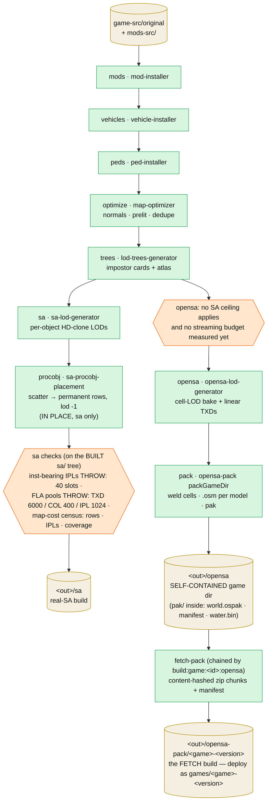

# perfect-map-builder

The offline orchestrator (`tools/perfect-map-builder`) that turns a stock GTA SA install + a mods folder into
the **one canonical build** every dev surface reads. `--out` defaults to `./build/original` (git-ignored,
regenerated each reconvert):

```
NODE_OPTIONS=--max-old-space-size=12288 npx tsx tools/perfect-map-builder/src/cli.ts \
  --game ./game-src/original --in ./mods-src
```

Each stage is another tool's Node API; every stage hands the next a **complete game dir**, so the chain can
stop anywhere (`--until <stage>`, inclusive, keeps intermediates). Intermediates live under
`<out>/.work/<n>-<stage>` and are deleted as consumed unless `--keep-work`/`--until`. **`.work` is wiped at
the top of every run, before any stage reads `--game`/`--in`** — so a source pointing into it is refused by
name rather than eaten ([restrictions/architecture.md](../restrictions/architecture.md)). Every stage is
timed and logged as it ends, and the run writes `<out>/build-timings.json` stating the target and the procobj
knobs it was configured with.

**A run asks for a TARGET, not for the whole pipeline** (`--exclude <stage,stage>`, repeatable): the named
stages are dropped and everything after them still runs. That is what the two `build:game:<id>:*` script
families are — `:opensa` is `--exclude sa`, `:sa` is `--exclude vehicles,peds,opensa` — and it exists because
the opensa target is rebuilt far more often than the real game's. The two write disjoint subtrees of the same
`--out` (`opensa/` + `opensa-pack/` vs `sa/`) and only `<out>/.work` is ever cleared, so an excluded target
keeps whatever an earlier run left. Excluding `opensa` drops `pack` with it; excluding `pack` alone leaves
`opensa/` in GAME format (the `--until opensa` result); excluding `sa` drops its `checkImgIdBudgets` guard,
which reads the `sa/` tree. An unknown `--exclude` name is an error — a typo must not silently produce a build
missing the target it was meant to keep.

**And a run says which HOST it is for** (`--target <sa|opensa>`, `resolveBuildTarget`): the selector for every
knob whose right value is a fact about the host rather than about the source data — limits, particle policy,
procobj density (07/04). Omitted, it is DERIVED from `--exclude`, which is what already declares a target in
practice: `--exclude sa` resolves to `opensa`, anything that still builds `sa/` resolves to `sa`. The
asymmetry is the shared common chain — a profile priced for an engine with no int16 cannot be handed to the
real game, so `--target opensa` alongside a `sa/` build is refused at config time; the conservative reverse is
allowed and logged. The resolved target is printed at the top of the run and reaches the `procobj` stage,
which reports that layer's price against it (objects · permanent text rows · rows/object).


<details><summary>diagram source</summary>



</details>

## Stages (`STAGE_NAMES` in `src/pipeline.ts`)

| #   | Stage      | Runs                                          | Notes                                                            |
| --- | ---------- | --------------------------------------------- | ---------------------------------------------------------------- |
| 1   | `mods`     | `installMods` (mod-installer)                 | skipped when `--in`'s `mods/` is empty; overlays + Modloader bake into `gta.dat`/`gta3.img` |
| 2   | `vehicles` | `installVehicles`                             | skipped when `vehicles/` is empty                                |
| 3   | `peds`     | `installPeds`                                 | skipped when `peds/` is empty                                    |
| 4   | `optimize` | `runOptimizer` (map-optimizer)                | lossless conditioning; `broken-prelight.json` force-list         |
| 5   | `trees`    | `buildTreeLods`                               | skipped when `vegetation/` is empty; `--tex` 512 atlas, `prelight.json` |
| 6   | `procobj`  | `buildProcobjLods`                            | **inside the `sa` branch, in place, AFTER its LOD build** (plan 014): the layer is that target's alone — OpenSA scatters the same species at runtime, so baking it into the common build would only cost that target a stripped `procobj.dat` and 91 092 vertex-duplicated instances in its pak. Always runs (original ships no `procobj/` — bakes the built-in roster, no-op on a TC). Its place in `STAGE_NAMES` is its place in the RUN order, so `--until sa` stops before the clutter |
| 7   | `sa`       | `buildSaLods` → `<out>/sa`, then `reportTextIplCensus` + `checkImgIdBudgets` | the real-game (RenderWare) target; **both read the built `sa/` tree and go with it** — the FLA ID pools THROW (a ceiling the target really has), the text-IPL cost is a census with no ceiling quoted (2026-08-09: the target always runs OLA + FLA + `perfect-map.asi`) |
| 8   | `opensa`   | `buildOpensaLods` + `swapLinearTxds`          | cell 250 bake (= the render grid, plan 087), `stripLods`, linear-convention TXD swap. No SA ceiling applies and no budget guard of its own exists yet — the run says so (`OPENSA_BUDGET_NOTICE`) |
| 9   | `pack`     | `packGameDir` (opensa-pack) → `<out>/opensa`  | the OpenSA target, self-contained (pak → `<out>/opensa/pak`, 086 phase 8); convert rect = the game's `PACK_RECTS.full` (auto-fit when unpinned, plan 087); report mirrored to `<out>/report.json` |
| 10  | `lod`      | —                                             | special `--until` value: run everything, keep every intermediate. **Not an `--exclude` value** — it names no stage to skip |

Every row but `lod` is an `--exclude` value (`EXCLUDABLE_STAGES`). Between stages 6 and 7 the pipeline
collects generated models + `lod-exclude.json` into `excludeItems` for both final LOD generators.

## Per-game data files (`mods-src/<game>/`, also honoured at the mods-src root)

Curated JSON, one concern each — a TC without a file simply gets none:

| File                   | Consumed by                       | Meaning                                                                                                            |
| ---------------------- | --------------------------------- | ------------------------------------------------------------------------------------------------------------------ |
| `lod-exclude.json`     | sa/opensa LOD generators          | models excluded from LOD generation (joined with the sibling generators' own models)                               |
| `lod-holes.json`       | cell bake (`holeFillModels`)      | models that ship NO authored LOD and hole the far view — exempt from the bake's reduction, carried VERBATIM (plan 086 ph 5; gostown bridges) |
| `lod-always.json`      | strip (`keepLods`) + pak weld     | lod-TARGET models that ARE the content behind a stub HD — the strip keeps them, the weld puts them in BOTH levels (plan 087 row D; gostown `LODEnsemble*` forests) |
| `broken-prelight.json` | map-optimizer prelight force list | models whose authored prelight is forced past the skip-guards and recomputed (plan 019)                            |
| `prelight.json`        | lod-trees bake                    | per-model prelight-skip overrides for the tree impostor bake                                                       |

## opensa-pack (the `pack` stage, also standalone)

`packGameDir` (`tools/opensa-pack/src/pack.ts`) converts a game-ready dir into the native build. `--out` is a
**copy of the game dir** in which every converted model's `dff`/`txd` inside the IMGs is replaced by one
sectioned `.osm`; the pak products go to `<out>/pak` (`--pak-out` to override — plan 086 phase 8, the game
dir is SELF-CONTAINED): `world.ospak` (welded cells + the shared world texture dictionary), `manifest.json`
(with `buildTime`), `water.bin`, `report.json`.

- **Weld first, models second** (order-critical): `weld.ts` merges the district into 250-unit render cells
  and produces the shared texture plan; `convertDistrict` then converts model classes
  (vehicles → breakables → clutter → props → anim-objects → peds → map objects). By-name classes keep private
  `TEXS` dictionaries; map objects reference the shared world dictionary
  (see [world-streaming.md](./world-streaming.md)).
- **`TexturePlanner`** (`textures.ts`) resolves `txdp` chains, runs the offline alpha pipeline
  (dilate/premultiply/mips/coverage), passes opaque DXT through untouched, and buckets textures into
  `texture_2d_array`s by exact (format, width, height, mips).
- Bakes: AO/skyVis **on by default** (`--no-ao` to skip — it replaces prod's SSAO); the heavy sun-vis shadow
  bake is opt-in (`--bakes`), and **off** in the pmb pack stage.

Point any host at the GAME DIR — it is self-contained (`pak/` inside; loaders also resolve legacy layouts
and a build-root pick): `?loader=http-dir&src=http://localhost:3001/build/original/opensa` (game),
`?src=…/build/original/opensa` (lab), `--after ./build/original/opensa` (viewers).

## fetch-pack (the SECOND build, plan 086 phase 8)

`tools/fetch-pack` (chained after pmb by every `build:game:<id>:opensa` alias) consumes the
self-contained `<out>/opensa` game dir and produces the independent FETCH build:
`<out>/opensa-pack/<game>-<version>/` — ~50 MB content-hashed zip chunks + a download `manifest.json`
(identity from the pak manifest's `game`/`appVersion`). Deploy = upload that folder to the static host as
`games/<game>-<version>/`; `--out ./static/games` stages a local fetch-mode test. Two independent builds
of the SAME bytes: `opensa/` for the folder/http-dir modes, `opensa-pack/` for hosted fetch. See
[fetch-pack.md](../features/fetch-pack.md) and the tool's `docs/plans/001-architecture.md`.
