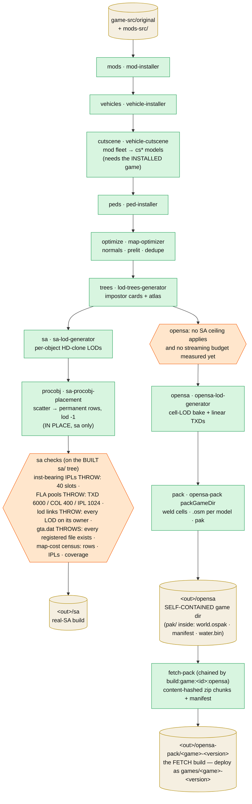

# perfect-map-builder

The offline orchestrator (`tools/perfect-map-builder`) that turns a stock GTA SA install + a mods folder into
the **one canonical build** every dev surface reads. `--out` defaults to `./build/original` (git-ignored,
regenerated each reconvert):

```
NODE_OPTIONS=--max-old-space-size=12288 npx tsx tools/perfect-map-builder/src/cli.ts \
  --game ./game-src/original --in ./mods-src
```

Each stage is another tool's Node API; every stage hands the next a **complete game dir**, so the chain can
stop anywhere (`--until <stage>`, inclusive, keeps intermediates).

**The chain opens with `split`** (img-splitter), and its position is the design rather than a preference:
`models/gta3.img` is divided into typed archives BEFORE anything installs, so every entry name lives in
exactly one of them and a mod replaces `admiral.dff` inside `vehicles.img` by name. Split later and a stock
car would sit in `gta3.img` while its replacement landed elsewhere — and which one the game loads with a name
in two registered archives is a question this ordering never has to ask. `config.splitBuckets` decides which
buckets get their own file; it defaults to `['vehicles']`, the shape that fits a stock archive table exactly
(8 slots, 6 already spent, and the mod car set spills into one sibling). See
[img-archive-layout.md](./img-archive-layout.md). Intermediates live under
`<out>/.work-<target>/<n>-<stage>` (plan 005: one work dir per target, so building one target never deletes
the other's kept stages) and are deleted as consumed unless `--keep-work`/`--until`. **The run's own work dir
is wiped at the top of every run, before any stage reads `--game`/`--in`** — so a source pointing into it is
refused by name rather than eaten ([restrictions/architecture.md](../restrictions/architecture.md)); the
other target's dir is not touched. Every stage is timed and logged as it ends, and the run writes
`<out>/build-timings.json` stating the target, the procobj knobs and the **sha256 of the `perfect-map.asi` it
shipped** — a map at this density is correct only with that asi, so the pairing is recorded rather than
remembered. Each target that runs also writes **`<out>/report-<target>.json`** (plan 005) at the end of its
chain: the target, the fetch game id, the timings and one typed fragment per stage that produced one —
optimize totals + failures; the sa census, FLA pools, lift requirements and asi sha (console-only before);
the pack summary with a pointer to `opensa/pak/report.json`. There is no unnamed root `report.json`: with two
targets in one `--out` it was a summary of whichever run finished last. **Planned (tool plan [006](../../tools/perfect-map-builder/docs/plans/006-resume.md)): a `resume.json` in that work dir plus per-chunk checkpoints inside `pack`, so `--resume` re-enters a failed run at its last finished step instead of stage 1 — the 2026-08-17 failure at the archive rewrite, the last step of a 55-minute run, is why.**

**What the `sa` branch emits BESIDE the map** (2026-08-11): after its ceiling checks it prints
`reportInstallRequirements` — every stock ceiling the artifact crosses and the setting that lifts each (int16
rows → `perfect-map.asi`, the `CBuilding` pool → OLA `Buildings`, rows-in-one-IPL → OLA `EntitiesPerIpl`, the
three FLA pools) — and then `shipPerfectMapAsi` copies the asi into the built game ROOT. The order is the
point: the report states what the map needs and the next line satisfies it. The artifact is pre-built
(`npm run build:asi`, MinGW) and `dist/` is gitignored, so a fresh checkout ships none and the build **warns**
rather than quietly emitting a tree that corrupts a plain install.

**A SECOND asi ships beside it when — and only when — the cutscene stage ran** (`shipPerfectCutsceneAsi`,
asi/perfect-cutscene plan 001 step 7): `perfect-cutscene.asi`, into the same game root, hashed into the same
report and `build-timings.json`. The gate is the coupling, not a preference. A converted cutscene car carries
real translucent atomics where vanilla ships almost none, and a `CCutsceneObject` renders inline in
world-sector scan order — so a fleet without the plugin puts back the draw-order roulette the 35-scene sweep
was closed on. It does NOT ship on a fleetless build: the deferred path renders at `RenderEntity`'s
alpha-test ref (100, or 0 in an interior) rather than the outdoor pass's 140, so on vanilla cutscene models
it could start drawing glass the main pass had always discarded — an unmeasured look change bought for
nothing. A build with no fleet therefore neither ships it nor warns about it; a build WITH one always says
which of the two happened.

**A run asks for a TARGET, not for the whole pipeline** (`--exclude <stage,stage>`, repeatable): the named
stages are dropped and everything after them still runs. That is what the two `build:game:<id>:*` script
families are — `:opensa` is `--exclude sa`, `:sa` is `--exclude vehicles,peds,opensa` — and it exists because
the opensa target is rebuilt far more often than the real game's. The two write disjoint subtrees of the same
`--out` (`opensa/` + `opensa-pack/` vs `sa/`) and only the run's own `<out>/.work-<target>` is ever cleared,
so an excluded target keeps whatever an earlier run left. Excluding `opensa` drops `pack` with it; excluding `pack` alone leaves
`opensa/` in GAME format (the `--until opensa` result); excluding `sa` drops its `checkImgIdBudgets` guard,
which reads the `sa/` tree. An unknown `--exclude` name is an error — a typo must not silently produce a build
missing the target it was meant to keep.

**And a run says which HOST it is for** (`--target <sa|opensa>`, `resolveBuildTarget`): the selector for every
knob whose right value is a fact about the host rather than about the source data — limits, particle policy,
procobj density (07/04). Omitted, it is DERIVED from `--exclude`, which is what already declares a target in
practice: `--exclude sa` resolves to `opensa`, anything that still builds `sa/` resolves to `sa`. The
asymmetry is the shared common chain — a profile priced for an engine with no int16 cannot be handed to the
real game, so `--target opensa` alongside a `sa/` build is refused at config time; the conservative reverse is
allowed and logged. The resolved target is printed at the top of the run and reaches the `procobj` stage,
which reports that layer's price against it (objects · permanent text rows · rows/object).


<details><summary>diagram source</summary>



</details>

## Stages (`STAGE_NAMES` in `src/pipeline.ts`)

| #   | Stage      | Runs                                          | Notes                                                            |
| --- | ---------- | --------------------------------------------- | ---------------------------------------------------------------- |
| 1   | `mods`     | `installMods` (mod-installer)                 | skipped when `--in`'s `mods/` is empty; overlays + Modloader bake into `gta.dat`/`gta3.img`. Takes the run's TARGET — a LAYERED `mods/` applies `common` then that target's own layer (below) |
| 2   | `vehicles` | `installVehicles`                             | skipped when `vehicles/` is empty                                |
| 3   | `cutscene` | `installCutscene` (vehicle-cutscene)          | the vehicles stage's shadow (vehicle-cutscene plan 002 step 11): converts the mod fleet into the `cs*` models of `models/cutscene.img` + patches `data/txdcut.ide`, reading the INSTALLED game (merged carcols, mod TXDs as txdp parents → the empty-TXD route, ~40 B per slot). **It also re-emits `anim/cuts.img`** — two passes over the SCENE data that no model change can reach: the wheel-stash sink (plan 004 round 20) and the seat retarget (plan 005), chained through one buffer and one write, each reporting per row in the summary. Both are surgical by construction: 2 of 444 entries differ from vanilla on the current fleet. Skipped when `vehicles/` is empty AND dropped — loudly — under `--exclude vehicles` (no installed parents = every slot fails closure). A slot error FAILS the build; the summary lands in every target report as the `cutscene` fragment |
| 4   | `peds`     | `installPeds`                                 | skipped when `peds/` is empty                                    |
| 5   | `optimize` | `runOptimizer` (map-optimizer)                | lossless conditioning; `broken-prelight.json` force-list         |
| 6   | `trees`    | `buildTreeLods`                               | skipped when `vegetation/` is empty; `--tex` 512 atlas, `prelight.json` |
| 7   | `procobj`  | `buildProcobjLods`                            | **inside the `sa` branch, in place, AFTER its LOD build** (plan 014): the layer is that target's alone — OpenSA scatters the same species at runtime, so baking it into the common build would only cost that target a stripped `procobj.dat` and 91 092 vertex-duplicated instances in its pak. Always runs (original ships no `procobj/` — bakes the built-in roster, no-op on a TC). Its place in `STAGE_NAMES` is its place in the RUN order, so `--until sa` stops before the clutter |
| 8   | `sa`       | `buildSaLods` → `<out>/sa`, then `reportTextIplCensus` + `assertLodLinks` + `checkImgIdBudgets` | the real-game (RenderWare) target; **all of them read the built `sa/` tree and go with it** — the FLA ID pools THROW (a ceiling the target really has), the text-IPL cost is a census with no ceiling quoted (2026-08-09: the target always runs OLA + FLA + `perfect-map.asi`), and every LOD link must resolve onto its owner (2026-08-16: a mod pack's stream merges had 11 of them one row off, silently — `tools/mod-installer/docs/plans/012-stream-merge-lod-space.md`). The link check runs HERE because every stage that edits an `inst` row has had its turn by now |
| 9   | `opensa`   | `buildOpensaLods` + `swapLinearTxds`          | cell 250 bake (= the render grid, plan 087), `stripLods`, linear-convention TXD swap. No SA ceiling applies and no budget guard of its own exists yet — the run says so (`OPENSA_BUDGET_NOTICE`) |
| 10  | `pack`     | `packGameDir` (opensa-pack) → `<out>/opensa`  | the OpenSA target, self-contained (pak → `<out>/opensa/pak`, 086 phase 8); convert rect = the game's `PACK_RECTS.full` (auto-fit when unpinned, plan 087); the pack's full report stays at `opensa/pak/report.json`, and `report-opensa.json` carries a summary + pointer (plan 005) |
| 11  | `lod`      | —                                             | special `--until` value: run everything, keep every intermediate. **Not an `--exclude` value** — it names no stage to skip |

Every row but `lod` is an `--exclude` value (`EXCLUDABLE_STAGES`). Between stages 7 and 8 the pipeline
collects generated models + `lod-exclude.json` into `excludeItems` for both final LOD generators.

## A mods folder may be LAYERED per target (mod-installer plan 011; vehicles and peds since 2026-08-17)

`mods-src/<game>/mods` is either FLAT — every subfolder a mod, what every game shipped until 2026-08-15 —
or LAYERED: `common/`, `sa/`, `opensa/`, all optional, each holding mod folders. A layered folder applies
`common` first and then the layer of the target this run resolved, so the target layer is the last writer.
Contract (including what a misspelled layer name does): [`contracts/mods.md`](../contracts/mods.md) §1.

**The stage sits in the chain both targets SHARE, so one run cannot serve two mod sets.** A run that would
build both targets over a layered folder is refused at config time and has to be run once per target — the
four `build:game:*` scripts already exclude one target each, so nothing the repo runs today is affected.
Rule: [`restrictions/architecture.md`](../restrictions/architecture.md). What one layer writes over the
other is answered empirically by `scripts/debug/mod-layer-conflicts.ts`, and the ids two mods claim for
different models by `scripts/debug/mod-id-collisions.ts`.

## A vehicles folder may carry candidates (vehicle-installer plan 007)

`mods-src/<game>/vehicles` is either FLAT — every subfolder a car — or STRUCTURED: `models/` (the fleet),
`new/` (candidates) and `screenshots/` (never installed). A car in `new/` REPLACES the `models/` car holding
the same SLOT — the folder name's first field, `<slot> - <car> - <author>` — so an A/B renames nothing.

The `models/`+`new/` shape is not target-dependent. **A vehicles folder — and a peds folder — may ALSO be
layered `common/` + `sa/` + `opensa/`** (vehicle-installer plan 010, ped-installer plan 005, 2026-08-17): the
same planner as mods (`@opensa/tool-kit/layers`), each vehicles layer flat or structured, the target layer
winning the SLOT (peds: the model). That shape IS target-dependent, so the same config-time refusal covers
`vehicles/` and `peds/` in a both-target run, and the pipeline passes its resolved target to `installVehicles`,
`installCutscene` and `installPeds`. Both the `vehicles` stage and its `cutscene` shadow read the folder through
the one resolver, `@opensa/tool-kit/vehicles-dir`. That sharing is the point — the cutscene fleet is built from the cars the
install chose, and a second reading of the tree is how the two drift apart. Contract (including the three
shapes it refuses): [`contracts/vehicles.md`](../contracts/vehicles.md) §1.

## Per-game data files (`mods-src/<game>/`, also honoured at the mods-src root)

Curated JSON, one concern each — a TC without a file simply gets none:

| File                   | Consumed by                       | Meaning                                                                                                            |
| ---------------------- | --------------------------------- | ------------------------------------------------------------------------------------------------------------------ |
| `lod-exclude.json`     | sa/opensa LOD generators          | models excluded from LOD generation (joined with the sibling generators' own models)                               |
| `lod-holes.json`       | cell bake (`holeFillModels`)      | models that ship NO authored LOD and hole the far view — exempt from the bake's reduction, carried VERBATIM (plan 086 ph 5; gostown bridges) |
| `lod-always.json`      | strip (`keepLods`) + pak weld     | lod-TARGET models that ARE the content behind a stub HD — the strip keeps them, the weld puts them in BOTH levels (plan 087 row D; gostown `LODEnsemble*` forests) |
| `broken-prelight.json` | map-optimizer prelight force list | models whose authored prelight is forced past the skip-guards and recomputed (plan 019)                            |
| `prelight.json`        | lod-trees bake                    | per-model prelight-skip overrides for the tree impostor bake                                                       |

## opensa-pack (the `pack` stage, also standalone)

`packGameDir` (`tools/opensa-pack/src/pack.ts`) converts a game-ready dir into the native build. `--out` is a
**copy of the game dir** in which every converted model's `dff`/`txd` inside the IMGs is replaced by one
sectioned `.osm`; the pak products go to `<out>/pak` (`--pak-out` to override — plan 086 phase 8, the game
dir is SELF-CONTAINED): `world.ospak` (welded cells + the shared world texture dictionary), `manifest.json`
(with `buildTime`), `water.bin`, `report.json`.

- **Weld first, models second** (order-critical): `weld.ts` merges the district into 250-unit render cells
  and produces the shared texture plan; `convertDistrict` then converts model classes
  (vehicles → breakables → clutter → props → anim-objects → peds → map objects). By-name classes keep private
  `TEXS` dictionaries; map objects reference the shared world dictionary
  (see [world-streaming.md](./world-streaming.md)).
- **`TexturePlanner`** (`textures.ts`) resolves `txdp` chains, runs the offline alpha pipeline
  (dilate/premultiply/mips/coverage), passes opaque DXT through untouched, and buckets textures into
  `texture_2d_array`s by exact (format, width, height, mips).
- Bakes: AO/skyVis **on by default** (`--no-ao` to skip — it replaces prod's SSAO); the heavy sun-vis shadow
  bake is opt-in (`--bakes`), and **off** in the pmb pack stage.

Point any host at the GAME DIR — it is self-contained (`pak/` inside; loaders also resolve legacy layouts
and a build-root pick): `?loader=http-dir&src=http://localhost:3001/build/original/opensa` (game),
`?src=…/build/original/opensa` (lab), `--after ./build/original/opensa` (viewers).

## fetch-pack (the SECOND build, plan 086 phase 8)

`tools/fetch-pack` (chained after pmb by every `build:game:<id>:opensa` alias) consumes the
self-contained `<out>/opensa` game dir and produces the independent FETCH build:
`<out>/opensa-pack/<game>-<version>/` — ~50 MB content-hashed zip chunks + a download `manifest.json`
(identity from the pak manifest's `game`/`appVersion`). Deploy = upload that folder to the static host as
`games/<game>-<version>/`; `--out ./static/games` stages a local fetch-mode test. Two independent builds
of the SAME bytes: `opensa/` for the folder/http-dir modes, `opensa-pack/` for hosted fetch. See
[fetch-pack.md](../features/fetch-pack.md) and the tool's `docs/plans/001-architecture.md`.
