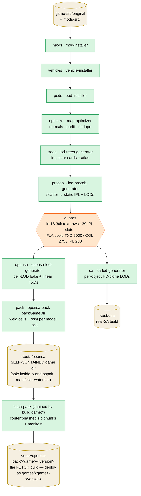

# perfect-map-builder

The offline orchestrator (`tools/perfect-map-builder`) that turns a stock GTA SA install + a mods folder into
the **one canonical build** every dev surface reads. `--out` defaults to `./build/original` (git-ignored,
regenerated each reconvert):

```
NODE_OPTIONS=--max-old-space-size=12288 npx tsx tools/perfect-map-builder/src/cli.ts \
  --game ./game-src/original --in ./mods-src
```

Each stage is another tool's Node API; every stage hands the next a **complete game dir**, so the chain can
stop anywhere (`--until <stage>`, inclusive, keeps intermediates). Intermediates live under
`<out>/.work/<n>-<stage>` and are deleted as consumed unless `--keep-work`/`--until`.


<details><summary>diagram source</summary>



</details>

## Stages (`STAGE_NAMES` in `src/pipeline.ts`)

| #   | Stage      | Runs                                          | Notes                                                            |
| --- | ---------- | --------------------------------------------- | ---------------------------------------------------------------- |
| 1   | `mods`     | `installMods` (mod-installer)                 | skipped when `--in`'s `mods/` is empty; overlays + Modloader bake into `gta.dat`/`gta3.img` |
| 2   | `vehicles` | `installVehicles`                             | skipped when `vehicles/` is empty                                |
| 3   | `peds`     | `installPeds`                                 | skipped when `peds/` is empty                                    |
| 4   | `optimize` | `runOptimizer` (map-optimizer)                | lossless conditioning; `broken-prelight.json` force-list         |
| 5   | `trees`    | `buildTreeLods`                               | skipped when `vegetation/` is empty; `--tex` 512 atlas, `prelight.json` |
| 6   | `procobj`  | `buildProcobjLods`                            | always (original ships no `procobj/` — bakes the built-in roster, no-op on a TC); `--tex` 128 |
| —   | guards     | `checkTextIplSlotBudget`, `checkImgIdBudgets` | the SA runtime ceilings — see [edge-cases](../edge-cases/)       |
| 7   | `sa`       | `buildSaLods` → `<out>/sa`                    | the real-game (RenderWare) target                                |
| 8   | `opensa`   | `buildOpensaLods` + `swapLinearTxds`          | cell 250 bake (= the render grid, plan 087), `stripLods`, linear-convention TXD swap |
| 9   | `pack`     | `packGameDir` (opensa-pack) → `<out>/opensa`  | the OpenSA target, self-contained (pak → `<out>/opensa/pak`, 086 phase 8); convert rect = the game's `PACK_RECTS.full` (auto-fit when unpinned, plan 087); report mirrored to `<out>/report.json` |
| 10  | `lod`      | —                                             | special `--until` value: run everything, keep every intermediate |

Between stages 6 and 7 the pipeline collects generated models + `lod-exclude.json` into `excludeItems` for
both final LOD generators.

## opensa-pack (the `pack` stage, also standalone)

`packGameDir` (`tools/opensa-pack/src/pack.ts`) converts a game-ready dir into the native build. `--out` is a
**copy of the game dir** in which every converted model's `dff`/`txd` inside the IMGs is replaced by one
sectioned `.osm`; the pak products go to `<out>/pak` (`--pak-out` to override — plan 086 phase 8, the game
dir is SELF-CONTAINED): `world.ospak` (welded cells + the shared world texture dictionary), `manifest.json`
(with `buildTime`), `water.bin`, `report.json`.

- **Weld first, models second** (order-critical): `weld.ts` merges the district into 250-unit render cells
  and produces the shared texture plan; `convertDistrict` then converts model classes
  (vehicles → breakables → clutter → props → anim-objects → peds → map objects). By-name classes keep private
  `TEXS` dictionaries; map objects reference the shared world dictionary
  (see [world-streaming.md](./world-streaming.md)).
- **`TexturePlanner`** (`textures.ts`) resolves `txdp` chains, runs the offline alpha pipeline
  (dilate/premultiply/mips/coverage), passes opaque DXT through untouched, and buckets textures into
  `texture_2d_array`s by exact (format, width, height, mips).
- Bakes: AO/skyVis **on by default** (`--no-ao` to skip — it replaces prod's SSAO); the heavy sun-vis shadow
  bake is opt-in (`--bakes`), and **off** in the pmb pack stage.

Point any host at the GAME DIR — it is self-contained (`pak/` inside; loaders also resolve legacy layouts
and a build-root pick): `?loader=http-dir&src=http://localhost:3001/build/original/opensa` (game),
`?src=…/build/original/opensa` (lab), `--after ./build/original/opensa` (viewers).

## fetch-pack (the SECOND build, plan 086 phase 8)

`tools/fetch-pack` (chained after pmb by every `build:game:*` alias) consumes the
self-contained `<out>/opensa` game dir and produces the independent FETCH build:
`<out>/opensa-pack/<game>-<version>/` — ~50 MB content-hashed zip chunks + a download `manifest.json`
(identity from the pak manifest's `game`/`appVersion`). Deploy = upload that folder to the static host as
`games/<game>-<version>/`; `--out ./static/games` stages a local fetch-mode test. Two independent builds
of the SAME bytes: `opensa/` for the folder/http-dir modes, `opensa-pack/` for hosted fetch. See
[fetch-pack.md](../features/fetch-pack.md) and the tool's `docs/plans/001-architecture.md`.
