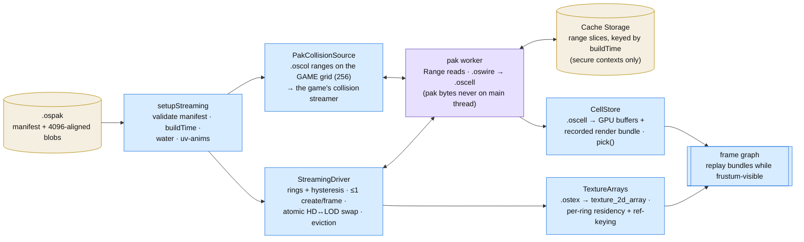

# Native formats & world streaming

The engine never parses RenderWare at runtime — everything is converted offline into the native formats in
`packages/engine-formats` and streamed from a single pak. Format details live in
[plan 074/02](../plans/074-opensa-engine/02-native-formats.md); this page is the map.

## The formats

| Format    | Magic  | One file is…                                  | Key contents                                                                                                                                                                                  |
| --------- | ------ | --------------------------------------------- | --------------------------------------------------------------------------------------------------------------------------------------------------------------------------------------------- |
| `.oscol`  | `OSCL` | one **cell's collision**, baked (plan 200/3) | regions: model name · flat vertex/index arrays · primitive boxes/spheres · the per-**triangle** surface table · the world transform of every placement · **v2**: the per-placement breakable instance keys, present exactly when the model shatters — the writer decides, so the reader never opens a DFF to ask. Replaces a 9.6-78.3 ms per-cell COL parse in the browser; a v1 file is REFUSED (its breakability is unknown, not "false") and the runtime falls back to COL |
| `.osm`    | `OSM1` | one **model** (vehicle/ped/prop/…), sectioned | `DESC` (JSON: parts/submeshes/wheels/layout) · `GEOM` · `COLL` (baked collision) · `HULL` · `SHAT` (shatter mesh) · `SKEL` · `TEXS` (the model's private texture dictionary)                  |
| `.ostex`  | `OST1` | one `texture_2d_array`                        | BC1/BC2/BC3/BC7/RGBA8, full offline mip chain, premultiplied alpha, alpha class (opaque/cutout/soft-blend)                                                                                    |
| `.oscell` | `OSC1` | one streamed **cell** level (HD or LOD)       | 36-byte vertices (pos, normal + baked sunVis, uv, day/night prelit, layer + AO/emissive channels), object/breakable/particle/light tables (object kinds incl. 4 uv-scroll / 5 timed uv-scroll, minor 7), pipeline classes opaque/cutout/blend/beam/**additive**, placement mapper for the debugger, roadsign glyph-quad COUNT (minor 8 — a diagnostic, drawn from no table) |
| `.oswire` | `OSW1` | meshopt-compressed transport of a cell        | the pak worker decodes it back into exact `.oscell` bytes                                                                                                                                     |
| `.ospak`  | —      | the **archive**                               | manifest (`game` + `appVersion` for fetch cache-keying (plan 086), `buildTime`, cells with offsets/hashes + per-cell texture refs + per-cell geometry `aabb` (world XZ — what the streaming rings test, plan 087), the **shared world texture dictionary**, uv animations, water (a LOOSE `water.bin` next to the pak — stride-20 `x,y,z,depth,class`, plan 075), `districts` (a LOOSE `districts.json` next to the pak — `info.zon`'s named boxes with their `american.gxt` text ALREADY RESOLVED, because a pak-only surface reaches neither file, 201/5-03), `missingLayers` — the stand-in layers the runtime's magenta highlight repaints, and `collision` + `collisionCellSize` — baked per-cell `.oscol` ranges keyed on the **GAME** grid (256), never on `cellSize` (250)) + 4096-aligned blobs; runtime reads byte ranges only. Entries are individually compressed and self-contained, so ONE cell is byte-replaceable (append + repoint) — but the dictionary's `(arrayRef, layer)` plan is not persisted, which is why in-place patching waits in `in-reserve/ospak-in-place-cell-patch.md` (opensa-lod-generator plan 007) |

Sections are read independently — the main thread takes `COLL` without touching geometry; consumers reject
unknown **major** versions loudly, minors only add optional sections.

**A vehicle's vertex streams carry two things the names do not say** (plan 084): the NIGHT colour set's
**alpha** is the model's own sky occlusion — a car has no prelit set, so that byte was a constant 255 and now
holds the AO the builder computes — and `reflect.x` is SPARE, because the reflection pipe reflects the live
probe rather than the DFF's env texture. `DESC` submeshes also gained an optional `extra` (which `extraN`
alternative a submesh belongs to; the spawn picks one), `tyre` (rubber, found by geometry, never
reflective) and `plate` (plan 082 — `'face'` = the `carplate` text strip, `'back'` = the `carpback` city
background, taken from the material's texture NAME, which conversion otherwise discards; never set on a
`_vlo` LOD mesh). All are additive: a pak built before them still reads, and its cars simply wear the stock
placeholder plate.

**`DESC` also carries the model's UV animations** (plan 099): `uvAnimations` — the DFF UVAnimDict entries
this model's materials actually reference, keyframes verbatim — plus a per-submesh `uvAnim` index into that
list. Model-LOCAL on purpose: the cell path registers dict names GLOBALLY (cells index one manifest array),
but a rigid model streams in and out on its own, so it carries its animations with it. Absent on the models
that animate nothing, which is every vehicle and nearly every prop — and on every `.osm` written before 099.

**`DESC` also carries a car's VehFuncs variant tree** (2026-08-17): `variants` — the `f_extras` / `f_class`
selector tree (`{ classes, extras }` of `VehicleVariantNode`: id = frame index, `select: [min, max]`,
`requires` class tags, `condition` verbatim) — plus a per-submesh `variant` naming the option a mesh belongs
to. The SPAWN walks it (`pickVariants`, `packages/renderware/src/vehicle/variants.ts`), the way the plugin
does on the SA target; a build-time pick would freeze one set of clutter, ads and body kits into every car
in the world. Absent on the models without one and on every `.osm` written before — where every variant is
drawn at once, which is what those cars looked like until then (59 of 213 original mod cars).

**Private vs world textures.** By-name classes (vehicles, peds, clutter, props, breakables) carry their own
dictionary in the `.osm` `TEXS` section — self-contained, viewable standalone. **Map objects** are planned
against the pak's shared world dictionary instead: their `.osm` is `DESC + GEOM` with global array
references (`textureSource: 'world'`), which keeps the full map at ~400 MB instead of ~3.7 GB of per-model
copies — but such a model only renders inside the streamed world.

## Streaming at runtime

diagram source

- **`stream/setup.ts`** — `setupStreaming(engine, source, radii, opened?)`: validates the manifest, spins up
  the pak worker (folder mode hands it the pak Blob; HTTP mode the `world.ospak` URL), returns
  `StreamSetup { buildTime?, cellSize, center, driver, radius, water? }`. A `LocalPakSource` returning `null`
  throws loudly — no fallback (see [boot-and-loading.md](./boot-and-loading.md)).
  Its first two steps need no GPU and are reachable on their own as **`openPakSource(source)` →
  `{ manifest, worker }`**, so a host can run them BESIDE `engine.init` and hand the result back as `opened`
  (201/4-03 — the dispatch console does; `engine.init` alone measured 2 607.5 ms on the phone). Omitting
  `opened` opens the source in place, exactly as before.
- **`stream/pak-worker.ts`** — all pak IO: HTTP Range mode when the server honours `Range:` (auto-detected;
  falls back to whole-pak), meshopt/`.oswire` decode, transfers cell blobs. JS heap stays flat — pak bytes
  never live whole on the main thread.
- **`stream/pak-cache.ts`** — the range slices kept BETWEEN sessions (201/4-03), so a second open of a
  district reads off the disk instead of the network. Range mode only; keyed by the manifest's `buildTime`,
  and the caches of other builds of the same pak are dropped on open. It is optional in three ways that all
  degrade to "fetch it": no Cache Storage (a LAN `http://` origin is not a secure context), no `buildTime`
  (an unversioned cache cannot be invalidated, so nothing is stored), and a refused write (quota — one
  warning, then network for the rest of the session). `pakTraffic.cachedBytes` is what a capture reports it
  by, and the boot shell shows the same share while the world streams.
- **`stream/residency.ts`** — `ResidencyGate`: the view half of the residency rule (plan 201/1-05). Builds
  the frustum planes from a host-supplied `CameraState` through `core/camera.ts` — the ONE owner of the
  reversed-Z / plan-view convention, shared with `Engine.frame`, so the set the streamer fetches and the set
  the frame culls cannot disagree — and answers box-vs-frustum and screen-space error (perspective divides
  by distance, the plan view does not). A host that passes a view gets residency decided by what the frame
  will draw; one that passes nothing keeps the rings, and the game shell is one on purpose
  ([restrictions/streaming-residency.md](../restrictions/streaming-residency.md)).
- **`stream/streaming.ts`** — `StreamingDriver`: ring model with hysteresis, the old level stays visible
  until its replacement is resident (atomic HD↔LOD swap), ≤1 cell create per frame, eviction outside the
  outer ring. The LOD ring doubles as the fog-mask boundary, and it tests the cell's TRUE geometry rect
  (manifest `aabb`; grid-rect fallback for pre-`aabb` paks) — an instance welds into the cell of its
  PIVOT, so meshes reach past the grid rect (gostown mean 141 u, max 799 u — plan 087) and a grid-rect
  ring skipped cells whose geometry already sat inside the fog. **Per-ring texture residency**: a shared
  array is fetched with the first cell that draws it and released with the last.
  **Since 201/1-05 the ring is the outer REACH rather than the whole rule**: with a view (and a pak stating
  every cell's `aabbY`) the request set is the frustum's, grown by one grid cell, with everything inside the
  HD ring exempt so a turn never waits on a fetch; eviction stays radial. The HD/LOD choice is screen-space
  error when the pak carries `geometricError` + `lodPixelThreshold` (the bake's own promise — see
  [perfect-map-builder.md](./perfect-map-builder.md)) and the HD radius otherwise. Both queues — the fetch,
  which is the network's order, and the ≤2 creates a frame — are sorted nearest-focus-first.
- **`stream/collision-source.ts`** — `PakCollisionSource`: the baked-collision half of the pak (plan
  200/3-01), present only when the manifest carries `collision`. Reads an entry's range through the SAME pak
  worker (keys prefixed `collision-`, so the driver ignores replies that are not its cells), de-dupes
  concurrent reads of one cell, and answers `null` for a cell with no bake or a failed read — the game layer
  then parses COL exactly as before. It publishes `cellSize` (the GAME grid, 256) because a consumer
  streaming on another grid would be handed a NEIGHBOURING cell's colliders; `GtaSaWorldAdapter` refuses such
  a source in its constructor.
- **`world/cells.ts`** — `CellStore`: one `.oscell` becomes GPU buffers + a recorded `GPURenderBundle`
  replayed while frustum-visible; also the debugger's ray `pick()` over the placement mapper (parsed only
  under `debugPicking`).
- **`world/textures.ts`** — `TextureArrays`: `.ostex` upload + material bind groups; CPU payload released
  after upload. **Streamed arrays upload RESUMABLY**: the worker's `message` handler only decodes and
  creates the texture (`beginLoad`), and the (layer, mip) writes drain from `StreamingDriver.update` under
  `UPLOAD_BUDGET_MS` (1.5 ms/frame, ≥1 write) — a whole-array upload in the handler ran between frames at
  15-85 ms a call, outside every budget the loop keeps (2026-07-27). `has(ref)` turns true only with the
  last write, so cells wait exactly as for an un-arrived array. The handler's residue is
  `StreamStats.blobMs` / `worstBlobMs`, the drain is `uploadMs`; the record lives in
  ([texture-upload-budget](../performance/applied/texture-upload-budget.md)). The eager boot path
  (pre-`textures` paks) and per-model dictionaries still upload in one go.

Dynamic models (`.osm`) load outside this path: vehicles/peds go through their own readers
(`readModelOsm` / `readPedOsm`) and workers — see [features/vehicles.md](../features/vehicles.md) and
[features/character.md](../features/character.md).
