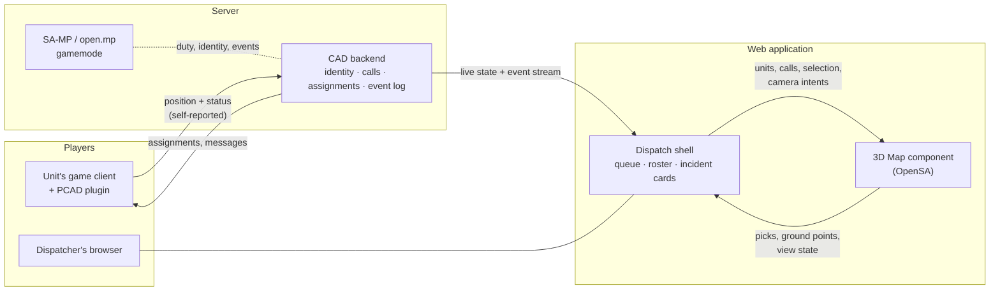

# 099 — PCAD Dispatch: the web dispatch application for a SA-MP server

**The final plan.** Everything else in this repository that concerns the dispatch direction is subordinate to
this document: [098](../098-dispatch-console/readme.md) is the engine work that makes this product's map
possible, and this is the product.

Opened 2026-08-06, after a requirements round and a survey of the field.

---

## 1. What is being built

**A web application for dispatch on a GTA San Andreas Multiplayer server, paired with a client-side CAD
plugin (PCAD).** A dispatcher — themselves a player — opens a browser, sees the city with every on-duty unit
moving in it, takes calls, assigns units, and works a shift. The units see their assignments in-game through
the same plugin.

Three pieces, and only one of them is this repository:

| Piece | What it does | Where it lives |
| --- | --- | --- |
| **PCAD** — the client plugin | runs beside the game on each player's machine; reports the unit's own position and status, receives assignments and messages | outside this repo |
| **The backend** | the single source of truth: identities, duty state, calls, assignments, the event log | outside this repo |
| **The web application** | the dispatcher's screen — call queue, roster, incident cards, **and the 3D map** | `apps/dispatch` here, plus a product shell |

**OpenSA's role is exactly one thing: the 3D map.** It is not the product, it is the component that draws the
world the units move in. That framing decides a lot below — most importantly that the map must be a
*replaceable, embeddable component with a narrow interface*, not the application that everything else is
bolted onto.

---

## 2. The field, and the gap we are aiming at

Roleplay dispatch is a mature market. Two systems define it:

| System | What it is | Its map |
| --- | --- | --- |
| **[SonoranCAD](https://sonorancad.com/fivem)** | the commercial leader for FiveM; deep in-game integration (`/911`, `/311`, `/panic`), unit lookups, drag-and-drop dispatching | a **2D tile map** with blips for units, calls and smart signs; custom tiles for paying communities. Its "3D live map" exists only for ER:LC (Roblox), not for GTA |
| **[SnailyCAD](https://snailycad.org/)** ([MIT](https://github.com/SnailyCAD/snaily-cadv4)) | the open-source benchmark: self-hosted CAD/MDT, TypeScript monorepo, Docker, Discord role sync, realtime sync of calls and statuses | a **2D live map**, shipped as a [separate integration](https://github.com/SnailyCAD/live-map) |

Read those two rows together and the gap is precise:

> **Every dispatch map in this market is a flat picture with dots on it. Nobody has the world.**

And the second gap: **both are FiveM.** SA-MP and open.mp — a large, older, still-populated ecosystem — are
served by nothing comparable.

We are the only project that can close both at once, because we already have the streamed San Andreas world
and a renderer for it. That is the whole strategic claim of this plan, and it also sets the bar: **the CAD
half must be as good as SnailyCAD's, or the 3D map is a demo attached to a worse product.** Feature parity on
the boring things — calls, statuses, roster, permissions, audit — is not optional, and it is the part with no
technical novelty and most of the work.

---

## 3. What we take from the open-source map engines

Nothing here needs inventing. Each row is a solved problem with a reference implementation to read.

| What we take | From | Why it matters here |
| --- | --- | --- |
| **LOD by screen-space error** — load a tile when its projected error exceeds N pixels | [CesiumJS](https://cesium.com/learn/cesiumjs/ref-doc/Cesium3DTileset.html) (`maximumScreenSpaceError`) | the map camera has no player to ring-stream around; this is the correct rule and it is [098/1-05](../098-dispatch-console/1-the-map-profile/readme.md) |
| **Time as an axis** — entity properties as functions over an interval, driven by a clock | CesiumJS / CZML | a self-reported position stream is a time series; [098/8](../098-dispatch-console/8-the-time-axis/readme.md) |
| **Label collision, priority and variable placement** | [MapLibre GL JS](https://deepwiki.com/maplibre/maplibre-native/3.3-symbol-placement-and-collision-detection) (sort keys, allow-overlap) | 150 units with symbols at city zoom is a decluttering problem, not a drawing one |
| **A layer model over the base world**, styled from data at runtime | [deck.gl](https://deck.gl/docs/developer-guide/base-maps/using-with-maplibre) | zones by workload, coverage, heat — the runtime-restyled layers, which our baked world cannot do by itself |
| **Measuring, annotation, cross-sections** on a 3D scene | [Giro3D / iTowns](https://github.com/giro3d-org/Giro3D) (three.js, MIT) | the operator tools in [098/7](../098-dispatch-console/7-the-operator-map/readme.md) |
| **A GTA-SA → tile projection and a tile pyramid** | [ikkentim/SanMap](https://github.com/ikkentim/SanMap) (Unlicense) | the flat-2D mode's coordinate scheme, proven and free |
| **Self-hosted CAD product shape** — Docker, Discord role sync, realtime state, permissions | [SnailyCAD](https://github.com/SnailyCAD/snaily-cadv4) (MIT) | the CAD half's feature checklist, written by people who ran it |

**And what we deliberately do not take:** [AmyrAhmady/samap](https://github.com/AmyrAhmady/samap)'s 48000×48000
raster. It covers stock San Andreas only — this engine exists to run total conversions, which have no such
image and never will — and the imagery is credited to gtagmodding rather than owned by the repo that
publishes it. We bake our own tiles from our own world with our own orthographic pass. The projection is
worth copying; the pictures are not.

---

## 4. Architecture

### The three seams, and who owns what

**PCAD → backend.** Each unit's own plugin reports that unit's own position. This is how the FiveM systems
work and it is the only thing a client plugin *can* do — a dispatcher's console never reads another player's
client. Two consequences that must be designed for, not discovered:

- **Positions are claims, not facts.** The backend treats them as untrusted input: rate-limited, sanity-checked
  against plausible speed, and attributed to an authenticated identity. A map that draws whatever it is sent
  is a map that can be lied to.
- **Only on-duty units exist.** Coverage is by definition partial — a unit whose PCAD is closed is invisible,
  and the console must say "not reporting" rather than draw a stale dot as if it were live.

**Backend → web application.** A live state snapshot plus an event stream. The contract comes before the
transport ([roadmap 0.6.0](../../roadmap/0.6.0/plans/05-dispatch-cad-depth/readme.md) already holds this
note): the event and snapshot shapes, what a reconnect replays, the position publish rate — because
[098/8's interpolation](../098-dispatch-console/8-the-time-axis/readme.md) is written against that rate — and
what an operator sees when the feed goes stale rather than empty.

**Shell → map.** The narrow interface that keeps the map a component:

| Direction | Payload |
| --- | --- |
| in | units and calls with positions over time, the selection, camera intents (`flyTo`, `follow`, `fitBounds`), the display mode, the moment in time |
| out | picks (a unit, a call, or a world point with its model/TXD names and GTA coordinates), the current view state, ready/degraded status |

Everything the map does today already fits this shape — `apps/dispatch` reads a board through stable getters
and never lets React into the frame loop. Keep it that way and the map can be embedded, replaced, or run
standalone without the shell.

---

## 5. Delivery

Ordered by what unblocks what. The user's instruction stands: **the engine first.**

### Phase 0 — The map earns its place (this repo, now)

[098 chains 1 and 2](../098-dispatch-console/readme.md): trim the engine to what a map draws, then measure it
on a real phone with a real district. Until that row exists, every claim about this product on a phone is
unproven — the repo's only mobile measurement is 41 fps on a synthetic city.

**Done when:** a benchmark row exists for a real district on real hardware, and the residency ceiling is
derived from it.

### Phase 1 — Three ways to draw the world (this repo)

[098/6](../098-dispatch-console/6-display-modes/readme.md). Live render, baked 3D city map, flat 2D tiles.
This is the phase that makes the product *deployable to real users on real hardware*, because it stops
depending on every dispatcher having a capable GPU. It is also the phase that beats the field: the 2D mode
matches what SonoranCAD and SnailyCAD have, and the other two exceed it.

**Done when:** the same district opens in all three modes, on a phone, and a device with no WebGPU still gets
a working map and is told why.

### Phase 2 — The contract, without a backend (this repo)

Write the PCAD → backend → shell contract into [`docs/contracts/`](../../contracts/) and make the console
consume it — fed by the existing mock. `stepOperations` stops being a simulation and becomes a *fake
implementation of a real interface*. [098/8](../098-dispatch-console/8-the-time-axis/readme.md)'s time axis
lands here, because interpolation is defined against a publish rate the contract names.

**Done when:** swapping the mock for a real socket changes one module and nothing else — the property
`apps/dispatch/src/ops/sim.ts` already claims in its header, made true and tested.

### Phase 3 — The product's dull half (outside this repo)

The CAD, at SnailyCAD's standard: identities and duty state, the call lifecycle, assignment rules, unit
statuses, permissions and roles on the admin side, Discord sync, an audit log, self-hosting. No technical
novelty, most of the work, and the thing that decides whether anyone runs it.

**Done when:** a community can install it and work a shift without touching the map.

### Phase 4 — PCAD and the live feed (outside this repo)

The client plugin and the transport. Last, because everything above can be built and demonstrated against the
contract, and because this is the piece most exposed to SA-MP/open.mp specifics.

**Done when:** a real shift runs on a real server, and the map shows what actually happened.

### Later, deferred by decision

Cross-shift history and incident search, multi-operator, install + offline cache, routed paths on the vehicle
node graph (`original`-only, so it lies on total conversions) — all in
[roadmap 0.6.0](../../roadmap/0.6.0/plans/05-dispatch-cad-depth/readme.md).

---

## 6. Budgets and the honest risk

Named with the user before the work ([the 098 budget table](../098-dispatch-console/readme.md)): **150 units
drawn as models with symbols, 60 fps on a phone, ≤3 s to a working picture, a hard 300–500 MB residency
ceiling.**

**These four may not hold simultaneously in the live render**, and this plan says so rather than discovering
it late. The evidence base is one synthetic mobile row at 41 fps with no streaming. Three honest outcomes,
in preference order:

1. the [map profile](../098-dispatch-console/1-the-map-profile/readme.md) frees enough that they all hold;
2. a screen-size threshold drops distant units to their symbols, and the budget holds with a stated rule;
3. the operator uses the baked 3D or 2D mode on weak hardware — **a choice, not a degradation**, which is
   precisely why phase 1 exists.

The measurement in phase 0 decides between them. No line of tuning happens before it.

**The other standing risk is scope.** The map is the interesting part and the CAD is the product. A beautiful
map attached to a worse CAD than the free one people already run is a losing position, and phase 3 is where
that is won or lost.

---

## 7. What this product is not

Settled 2026-08-06 and recorded so they are not reopened:

- **Not a real-world mapping product.** No OSM/tile/CityGML import, no CRS layer. GTA coordinates, one
  conversion, one place (`apps/dispatch/src/map/coords.ts`).
- **Not a game.** No player, no physics, no ECS in the map component — that boundary is
  [a restriction](../../restrictions/architecture.md) and it is what keeps the map embeddable.
- **Not the voice/chat layer.** PCAD carries the dispatcher's traffic to units; the console does not become a
  radio.
- **Not multi-role.** One role — the dispatcher. The field unit's screen is the plugin's business.
- **Not populated with decoration.** Only real players are drawn, so nothing on the map is ever mistaken for
  data.
- **No interiors.** The map is the street; a unit indoors keeps its symbol at the door.

---

## 8. Still open

Questions this plan does not answer, listed so they are visible rather than assumed:

- **Which server stack** — classic SA-MP, or open.mp? It changes what PCAD can do and how identity is proven.
- **What PCAD is technically** — an ASI/CLEO-class client plugin, or something the launcher hosts? It decides
  the position publish rate and therefore the interpolation.
- **How a unit's identity is proven** to the backend, so a self-reported position can be trusted enough to
  draw.
- **Hosting** — self-hosted per community like SnailyCAD, or one service? This decides the map's asset
  delivery (a pak per community is very different from one shared build).
- **Whether the world shown is stock SA or the server's own total conversion.** All three display modes are
  generated per build, so both work — but the answer sets which build phase 0 measures.

---

## Related work in this repository

| Doc | What it holds |
| --- | --- |
| [098 — the dispatch console](../098-dispatch-console/readme.md) | all engine and map work: the map profile, real-device truth, the phone surface, render-on-demand, symbology and picking, the three display modes, the operator's map, the time axis |
| [097 — platform reach](../097-platform-reach/readme.md) | the device half: universal textures, off-main-thread work, WebGL2. 098 hands it the phone measurement it is blocked on |
| [project-goals, directive 7](../../project-goals.md) | why the engine has a second consumer and what that consumer may not do |
| [restrictions/architecture.md](../../restrictions/architecture.md) | the four silent rules found while reading the console against the layer boundaries |
| [roadmap 0.6.0 — CAD depth](../../roadmap/0.6.0/plans/05-dispatch-cad-depth/readme.md) | the deferred half: live feed transport, cross-shift history, multi-operator, offline |
