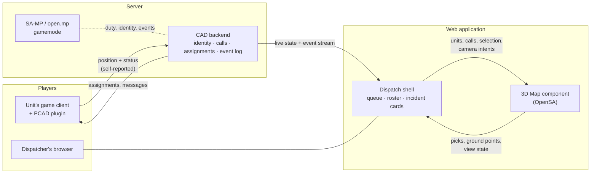

# 202 — PCAD Dispatch: the web dispatch application for a SA-MP server

**The final plan.** Everything else in this repository that concerns the dispatch direction is subordinate to
this document: [201](../201-dispatch-console/readme.md) is the engine work that makes this product's map
possible, and this is the product.

Opened 2026-08-06, after a requirements round and a survey of the field.

---

## 1. What is being built

**A web application for dispatch on a GTA San Andreas Multiplayer server, paired with a client-side CAD
plugin (PCAD).** A dispatcher — themselves a player — opens a browser, sees the city with every on-duty unit
moving in it, takes calls, assigns units, and works a shift. The units see their assignments in-game through
the same plugin.

**PCAD already exists and works** (`sexorcist00/pcad`, private, read 2026-08-06). This plan was first written
as if the product had to be built; it does not. What is missing from it is one thing, and it is the one thing
this repository makes.

| Piece | What it is, concretely | State |
| --- | --- | --- |
| **PCAD client** | a MoonLoader Lua script for GTA:SA / SA-MP 0.3.7-R5 (`sampapi`), ~16k lines across `cad_system/*.lua`, ImGui interface, WebSocket via `websocketsamp.dll`, self-updating (`cad_autoupdate.lua`, v1.2.3-beta) | **built** |
| **Backend** | Node.js `ws` server on :8443, MariaDB (`caddata`), bcrypt + JWT auth, Discord.js role gate, Google APIs. Services: Unit (1.1k lines), TacticalAssist, RMS (3.2k lines client-side), Radio, Discord; `server.js` is 4.1k lines | **built** |
| **Web application** | the dispatcher's screen served from `backend/public/cad-frontend` — units, calls, incidents, BOLO, radio, command modules — plus a **React/Vite/Tailwind rewrite in progress** (`vibecode/`, with its own migration plan onto Zustand + one WS hook) | **built, being rewritten** |
| **The map** | today a **2D tile canvas**: `tiles/*.png` (~5 MB), `worldToMapPoint`/`mapPointToWorld`, pan/point/circle/line draw modes, and **bounds calibrated by hand per operator into localStorage** | **this is the gap** |

**OpenSA's role is exactly one thing: the 3D map** — module 10 of the vibecode migration, the one its own
plan calls a high-complexity imperative "island" with `useRef` + `useEffect` and logic kept close to the
original. That is precisely the shape `apps/dispatch` already has: React never enters the frame loop, and the
board is read through stable getters. The two designs met independently, which is the strongest available
signal that the seam is in the right place.

Two consequences worth stating plainly:

- **This plan's delivery order was wrong and is corrected below.** The "dull half" is not ahead of us, it is
  behind us. The remaining work is almost entirely the map.
- **The hand-calibrated map bounds disappear.** The current 2D map needs an operator to align a picture to the
  world and store it in localStorage. Our engine *is* the world — GTA coordinates are exact, and
  `apps/dispatch/src/map/coords.ts` is the only conversion. Deleting a calibration step is a small feature
  and a very good demonstration.

---

## 2. The field, and the gap we are aiming at

Roleplay dispatch is a mature market. Two systems define it:

| System | What it is | Its map |
| --- | --- | --- |
| **[SonoranCAD](https://sonorancad.com/fivem)** | the commercial leader for FiveM; deep in-game integration (`/911`, `/311`, `/panic`), unit lookups, drag-and-drop dispatching | **a 3D live map, for GTA V, since some time before 2026-08-26** — a `2D / 2.5D / 3D` switch in the Live Map window's toolbar, over a solid model of Los Santos, with a camera pad and unit markers carrying bodycam previews. This row said the opposite until 2026-08-26 and was wrong |
| **[SnailyCAD](https://snailycad.org/)** ([MIT](https://github.com/SnailyCAD/snaily-cadv4)) | the open-source benchmark: self-hosted CAD/MDT, TypeScript monorepo, Docker, Discord role sync, realtime sync of calls and statuses | a **2D live map**, shipped as a [separate integration](https://github.com/SnailyCAD/live-map) |

**Corrected 2026-08-26, and the correction matters.** This section used to close on
*"every dispatch map in this market is a flat picture with dots on it — nobody has the world"*. That is no
longer true and it must not be quoted: SonoranCAD ships a 3D live map for FiveM. The screenshot it was read
off is filed in [the console's design landscape](../../../apps/dispatch/DESIGN.md).

What survives the correction, stated narrowly enough to be defensible:

1. **Nobody serves SA-MP or open.mp.** Both systems above are FiveM only, and this is a large, older,
   still-populated ecosystem with nothing comparable. This is the gap the product is aimed at.
2. **Nobody has a TOTAL-CONVERSION world.** Sonoran's 3D map is stock Los Santos, and SnailyCAD's flat map
   is a stock raster. Ours is whatever the pak was built from — which is the one thing an engine can do and
   a picture cannot.
3. **Nobody makes the map the main screen.** Measured across four consoles on 2026-08-26
   ([201/7-08](../201-dispatch-console/7-the-operator-map/readme.md)): SnailyCAD puts the map on a separate
   page, Sonoran in a separate window, Resgrid in a card at 9.1 % of the screen, CrowdCAD not at all. That
   one is now a decision this repository has taken and shipped, rather than an observation.

What does NOT survive: "we are the only project that can render the world". We are not, since Sonoran does
it too — we are the only one that can render *any* world, on the ecosystem nobody serves, with the map as
the product rather than a viewer beside it.

The bar is unchanged and was never about the map: **the CAD half must be as good as SnailyCAD's, or the 3D
map is a demo attached to a worse product.** Feature parity on the boring things — calls, statuses, roster,
permissions, audit — is not optional, and it is the part with no technical novelty and most of the work.

**And there is a shortcut for that half, found 2026-08-26 and decided with the user.** SnailyCAD publishes
its design system as **[`@snailycad/ui`](https://github.com/SnailyCAD/snaily-cadv4)** — MIT, v1.80.2,
tsup-built, with Storybook and Chromatic visual regression, on React Aria plus a few Radix primitives,
Tailwind and `next` as a **peer dependency**. For the CAD half that is not a thing to fork, it is a thing to
**depend on**: vibecode is a Next application and list-first, which is exactly the product that package was
built for, and its combobox / date-picker / listbox work is the part with the most tedium and the least
novelty in the whole plan.

**The map half does the opposite, and deliberately.** `apps/dispatch` is Vite, Tailwind-free and ships as an
embeddable widget with zero runtime dependencies ([201/7-09](../201-dispatch-console/7-the-operator-map/readme.md)),
so the same package would bring `next`, Tailwind's global preflight and ~50 dependencies into something
whose whole contract is that it cannot leak into its host. One product, two answers, because the two halves
have opposite constraints — and the seam between them is the one in §4.

---

## 3. What we take from the open-source map engines

Nothing here needs inventing. Each row is a solved problem with a reference implementation to read.

| What we take | From | Why it matters here |
| --- | --- | --- |
| **LOD by screen-space error** — load a tile when its projected error exceeds N pixels | [CesiumJS](https://cesium.com/learn/cesiumjs/ref-doc/Cesium3DTileset.html) (`maximumScreenSpaceError`) | the map camera has no player to ring-stream around; this is the correct rule and it is [201/1-05](../201-dispatch-console/1-the-map-profile/readme.md) |
| **Time as an axis** — entity properties as functions over an interval, driven by a clock | CesiumJS / CZML | a self-reported position stream is a time series; [201/8](../201-dispatch-console/8-the-time-axis/readme.md) |
| **Label collision, priority and variable placement** | [MapLibre GL JS](https://deepwiki.com/maplibre/maplibre-native/3.3-symbol-placement-and-collision-detection) (sort keys, allow-overlap) | 150 units with symbols at city zoom is a decluttering problem, not a drawing one |
| **A layer model over the base world**, styled from data at runtime | [deck.gl](https://deck.gl/docs/developer-guide/base-maps/using-with-maplibre) | zones by workload, coverage, heat — the runtime-restyled layers, which our baked world cannot do by itself |
| **Measuring, annotation, cross-sections** on a 3D scene | [Giro3D / iTowns](https://github.com/giro3d-org/Giro3D) (three.js, MIT) | the operator tools in [201/7](../201-dispatch-console/7-the-operator-map/readme.md) |
| **A GTA-SA → tile projection and a tile pyramid** | [ikkentim/SanMap](https://github.com/ikkentim/SanMap) (Unlicense) | the flat-2D mode's coordinate scheme, proven and free |
| **Self-hosted CAD product shape** — Docker, Discord role sync, realtime state, permissions | [SnailyCAD](https://github.com/SnailyCAD/snaily-cadv4) (MIT) | the CAD half's feature checklist, written by people who ran it |

**And what we deliberately do not take:** [AmyrAhmady/samap](https://github.com/AmyrAhmady/samap)'s 48000×48000
raster. It covers stock San Andreas only — this engine exists to run total conversions, which have no such
image and never will — and the imagery is credited to gtagmodding rather than owned by the repo that
publishes it. We bake our own tiles from our own world with our own orthographic pass. The projection is
worth copying; the pictures are not.

---

## 4. Architecture

### The three seams, and who owns what

**PCAD → backend.** Each unit's own plugin reports that unit's own position — the only thing a client plugin
*can* do. The real numbers, read from the code rather than assumed:

| Fact | Value | Where |
| --- | --- | --- |
| Position publish rate | **every 4 s** | `cadui.lua`, the `sendPositionUpdate` thread |
| Payload | `pos_x, pos_y, pos_z, heading, vehicleId` over `unit_update_position` | same |
| **Sent only while the unit is in a vehicle** | `isCharInAnyCar` gates the whole function — **on foot, nothing is sent** | same |
| Status broadcast | every 15 s | `broadcastUnitStatus` thread |
| Heartbeat / stale handling | heartbeat 20 s; a unit goes stale after 300 s, swept every 120 s | `server.js` |

**A 4-second publish rate is the single hardest constraint on the 3D map, and it was not knowable before
reading the code.** A car at 100 km/h covers ~110 m between packets. Naive linear interpolation over that gap
draws a unit gliding in a straight line through buildings — smooth, confident and wrong, which is worse on a
3D map than on a tile map because the world around it makes the error obvious. Three honest responses, and
the choice is measured rather than argued:

1. **raise the rate** in PCAD (a client change, and the cheapest fix by far);
2. **draw the uncertainty** — a marker that widens as its fix ages, instead of a confident dot;
3. **snap to the road graph** — blocked on `data/Paths` being `original`-only
   ([assets-and-data](../../restrictions/assets-and-data.md)), so it lies on total conversions.

Whatever wins, [201/8's rule stands](../201-dispatch-console/8-the-time-axis/readme.md): interpolate between
what arrived, never extrapolate past it.

**On foot, a unit has no position at all.** The map must show that state honestly — last known, aging — and
not a dot parked at the car the unit left. This is a PCAD gap, not a map gap, and it is listed as such below.

**The fix arrives finished, and the map adds nothing to it** (settled with the user 2026-08-26). The run that
published it had collision — the game held the car on the road, which is why `pos_z` is a road height rather
than a hole — so the console applies the position, the height and the facing verbatim. On the map a unit is a
**model drawn on the world, not an object in it**: no physics, no ground snap, no re-simulation, which is
what [201/5-04](../201-dispatch-console/5-symbology-and-picking-as-product/readme.md) settles as kinematic and
what frees [201/1-03](../201-dispatch-console/1-the-map-profile/readme.md) of the baked collision. It is a
[restriction](../../restrictions/architecture.md) now, because the violation looks like an improvement.

**Two conversions the wiring owes, and both are silent when wrong.** The map's placement is verified against
the game's own (`[x, z, −y]`, height verbatim — `apps/dispatch/src/map/coords.test.ts`), so the remaining risk
is at the seam: **the heading is SA's z-angle, degrees counter-clockwise, and this map's is a bearing in
radians clockwise** — passed through raw it mirrors every unit's facing about the north–south axis, which
reads as a plausible car going somewhere else (`headingFromZAngle` exists for exactly this, and is the only
way in). And the `vehicleId` field: a slot id means different things in two builds
([assets-and-data](../../restrictions/assets-and-data.md)), so **what a unit drives reaches the map as a model
NAME** — resolved wherever the build's own tables are, never guessed by the console.

**Positions are claims, not facts.** They are self-reported by an authenticated client. The backend already
attributes them to a JWT identity behind a Discord role gate; what it does not do is sanity-check them
against plausible speed. A map that draws whatever it is sent is a map that can be lied to.

**Backend → web application.** A live state snapshot plus an event stream. The contract comes before the
transport ([roadmap 0.6.0](../../roadmap/0.6.0/plans/05-dispatch-cad-depth/readme.md) already holds this
note): the event and snapshot shapes, what a reconnect replays, the position publish rate — because
[201/8's interpolation](../201-dispatch-console/8-the-time-axis/readme.md) is written against that rate — and
what an operator sees when the feed goes stale rather than empty.

**Shell → map.** The narrow interface that keeps the map a component:

| Direction | Payload |
| --- | --- |
| in | units and calls with positions over time, the selection, camera intents (`flyTo`, `follow`, `fitBounds`), the display mode, the moment in time |
| out | picks (a unit, a call, or a world point with its model/TXD names and GTA coordinates), the current view state, ready/degraded status |

Everything the map does today already fits this shape — `apps/dispatch` reads a board through stable getters
and never lets React into the frame loop. Keep it that way and the map can be embedded, replaced, or run
standalone without the shell.

---

## 5. Delivery

Ordered by what unblocks what. The user's instruction stands: **the engine first.**

### Phase 0 — The map earns its place (this repo, now)

[201 chains 1 and 2](../201-dispatch-console/readme.md): trim the engine to what a map draws, then measure it
on a real phone with a real district. Until that row exists, every claim about this product on a phone is
unproven — the repo's only mobile measurement is 41 fps on a synthetic city.

**Done when:** a benchmark row exists for a real district on real hardware, and the residency ceiling is
derived from it.

### Phase 1 — Three ways to draw the world (this repo)

[201/6](../201-dispatch-console/6-display-modes/readme.md). Live render, baked 3D city map, flat 2D tiles.
This is the phase that makes the product *deployable to real users on real hardware*, because it stops
depending on every dispatcher having a capable GPU. It is also the phase that beats the field: the 2D mode
matches what SonoranCAD and SnailyCAD have, and the other two exceed it.

**Done when:** the same district opens in all three modes, on a phone, and a device with no WebGPU still gets
a working map and is told why.

### Phase 2 — Speak PCAD's protocol (this repo)

Not "design a contract" — **document the one that already runs** and make the console consume it. The
protocol exists in `server.js` and `cad_websocket.lua`; what does not exist is a written statement of it that
two codebases can be built against. Write it into [`docs/contracts/`](../../contracts/): the message names,
the unit and call shapes, the 4-second publish rate, what a reconnect replays, and the stale/timeout
semantics the backend already implements.

Then `stepOperations` stops being a simulation and becomes a **fake implementation of that real interface**,
and [201/8's time axis](../201-dispatch-console/8-the-time-axis/readme.md) is built against a rate taken from
the code rather than invented.

**Done when:** the console runs against a recorded capture of real traffic, and swapping the mock for the
live socket changes one module — the property `apps/dispatch/src/ops/sim.ts` already claims in its header,
made true and tested.

### Phase 3 — The map becomes vibecode's module 10 (both repos)

The React rewrite's migration plan already reserves the slot: an imperative map island, `useRef` +
`useEffect`, highest complexity, last wave. This phase fills it with the OpenSA map instead of a port of the
old tile canvas — the shell passing units, calls, selection, camera intents and the moment in time in, and
getting picks and view state back.

The old 2D canvas does not get deleted; it becomes the **flat-2D display mode**
([201/6](../201-dispatch-console/6-display-modes/readme.md)), which is what an operator on a weak machine
should be looking at anyway. Its hand-calibrated `mapBounds` go away, because the engine knows the
coordinates exactly.

**Done when:** a dispatcher can work a whole shift on the 3D map without reaching for the old one, and can
switch to it whenever they want.

### Phase 4 — What PCAD owes the map (the other repo)

Two gaps this plan found by reading the client, neither of which the current tile map exposes:

- **positions on foot** — nothing is sent unless the unit is in a vehicle;
- **the publish rate** — 4 s is survivable on a tile map and visibly wrong on a 3D one.

Both are small client changes and both are worth measuring before choosing: raise the rate and see what the
map looks like, before building uncertainty rendering to compensate for a rate nobody tried to change.

**Done when:** a real shift runs, and the units move the way the world says they should.

### Later, deferred by decision

Cross-shift history and incident search, multi-operator, install + offline cache, routed paths on the vehicle
node graph (`original`-only, so it lies on total conversions) — all in
[roadmap 0.6.0](../../roadmap/0.6.0/plans/05-dispatch-cad-depth/readme.md).

---

## 6. Budgets and the honest risk

Named with the user before the work ([the 201 budget table](../201-dispatch-console/readme.md)): **150 units
drawn as models with symbols, 60 fps on a phone, ≤3 s to a working picture, a hard 300–500 MB residency
ceiling.**

**These four may not hold simultaneously in the live render**, and this plan says so rather than discovering
it late. The evidence base is one synthetic mobile row at 41 fps with no streaming. Three honest outcomes,
in preference order:

1. the [map profile](../201-dispatch-console/1-the-map-profile/readme.md) frees enough that they all hold;
2. a screen-size threshold drops distant units to their symbols, and the budget holds with a stated rule;
3. the operator uses the baked 3D or 2D mode on weak hardware — **a choice, not a degradation**, which is
   precisely why phase 1 exists.

The measurement in phase 0 decides between them. No line of tuning happens before it.

**The other standing risk is scope.** The map is the interesting part and the CAD is the product. A beautiful
map attached to a worse CAD than the free one people already run is a losing position, and phase 3 is where
that is won or lost.

---

## 7. What this product is not

Settled 2026-08-06 and recorded so they are not reopened:

- **Not a real-world mapping product.** No OSM/tile/CityGML import, no CRS layer. GTA coordinates, one
  conversion, one place (`apps/dispatch/src/map/coords.ts`).
- **Not a game.** No player, no physics, no ECS in the map component — that boundary is
  [a restriction](../../restrictions/architecture.md) and it is what keeps the map embeddable.
- **Not the voice/chat layer.** PCAD carries the dispatcher's traffic to units; the console does not become a
  radio.
- **Not multi-role.** One role — the dispatcher. The field unit's screen is the plugin's business.
- **Not populated with decoration.** Only real players are drawn, so nothing on the map is ever mistaken for
  data.
- **No interiors.** The map is the street; a unit indoors keeps its symbol at the door.

---

## 8. Still open

Answered by reading `sexorcist00/pcad` on 2026-08-06: the server stack (SA-MP 0.3.7-R5 via `sampapi`), what
PCAD is (a MoonLoader Lua script with an ImGui interface over a WebSocket), how identity is proven (bcrypt
login → JWT, behind a Discord role gate), and the publish rate (4 s, vehicles only).

What is still genuinely open:

- **Hosting** — self-hosted per community like SnailyCAD, or one service? This decides the map's asset
  delivery, and a pak per community is a very different problem from one shared build. It is the biggest
  unanswered question for phase 0, because it decides *what* gets measured.
- **Whether the world shown is stock SA or the server's own total conversion.** All three display modes are
  generated per build, so both work — but the answer sets which build gets measured first.
- **How much of the map an operator on a weak machine actually gets.** Phase 1's three modes make this a
  choice; what has not been decided is the default.

## Preconditions in PCAD, before this ships to real users

Found while reading the repository, listed here because the map will ship inside that application and
inherits its posture. None of them is a map problem and all of them outrank the map:

- **The JWT signing secret is a hardcoded placeholder string in `server.js`** and is what every auth token is
  signed and verified with. Anyone who has seen the source — or guesses a very common placeholder — can mint
  a token for any user. This is an authentication bypass and it does not depend on the repository being
  private. Move it to an environment variable, rotate it, and invalidate existing tokens.
- **Live credentials are committed**: database credentials and a Discord bot token in `cad_config.json`, a
  Google service-account private key in `credentials.json`, and a MariaDB dump of `caddata` at the repository
  root. The repository is private today, which is not a control — they are in the history of every clone.
  Rotate all of them, remove the files, and keep configuration out of git.
- **Self-reported positions are not sanity-checked** against plausible speed. Once the map draws a world
  around them, a fabricated position becomes a much more useful lie than it is today.
- **The auto-updater fetches client code from a raw GitHub URL under a different account** than the one
  hosting this repository. Whoever controls that account controls the code on every client machine. Confirm
  the ownership, or move the update source.

---

## Related work in this repository

| Doc | What it holds |
| --- | --- |
| [201 — the dispatch console](../201-dispatch-console/readme.md) | all engine and map work: the map profile, real-device truth, the phone surface, render-on-demand, symbology and picking, the three display modes, the operator's map, the time axis |
| [200 — platform reach](../200-platform-reach/readme.md) | the device half: universal textures, off-main-thread work, WebGL2. 201 hands it the phone measurement it is blocked on |
| [project-goals, directive 7](../../project-goals.md) | why the engine has a second consumer and what that consumer may not do |
| [restrictions/architecture.md](../../restrictions/architecture.md) | the four silent rules found while reading the console against the layer boundaries |
| [roadmap 0.6.0 — CAD depth](../../roadmap/0.6.0/plans/05-dispatch-cad-depth/readme.md) | the deferred half: live feed transport, cross-shift history, multi-operator, offline |
