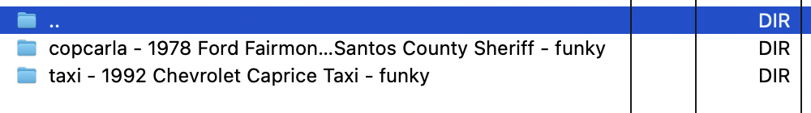
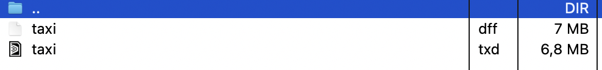
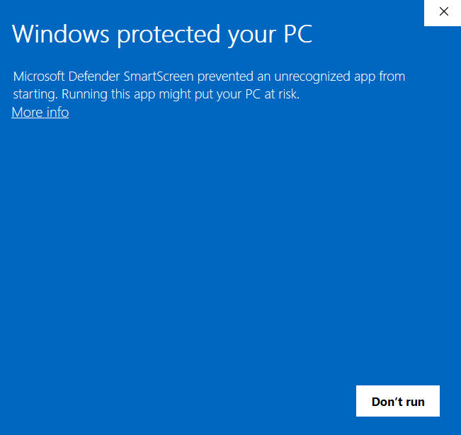
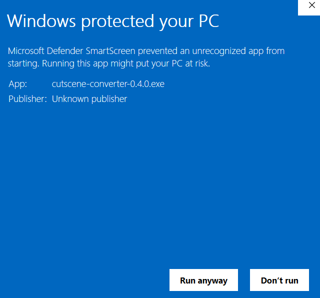
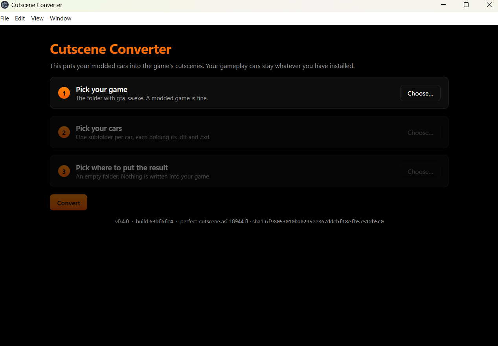
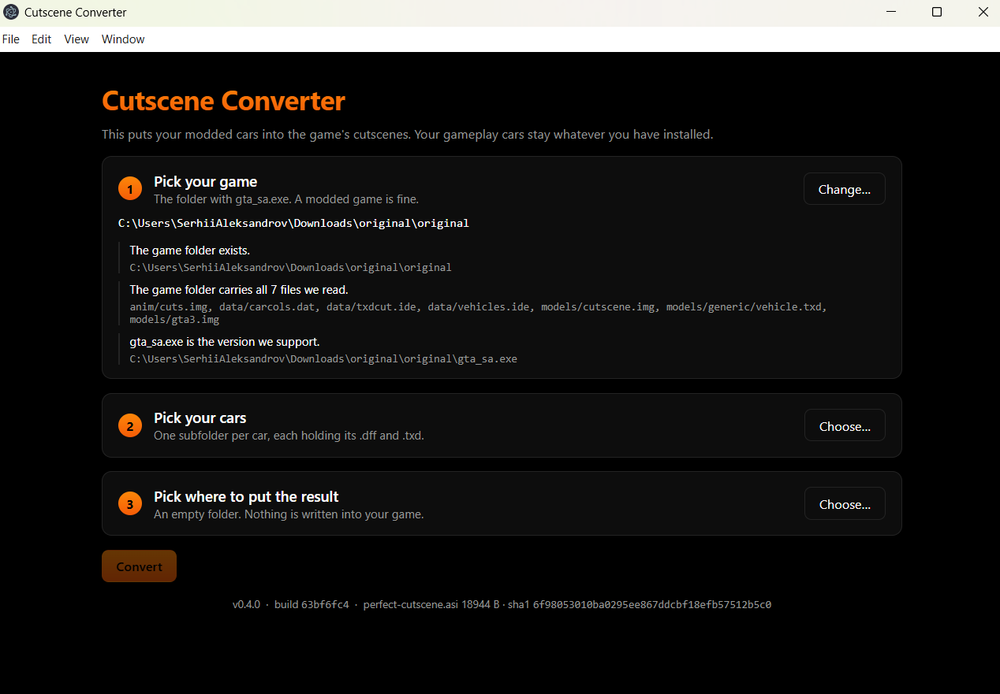
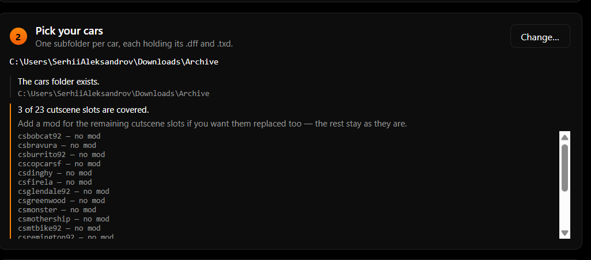
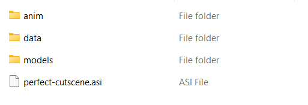

# Cutscene Converter

This app puts your modded cars into GTA: San Andreas cutscenes.

The game shows a car twice: once when you drive it and once in a cutscene. A car mod only changes the first one — the cutscenes keep the stock 2004 models. This app fixes the second half and **leaves gameplay alone**: whatever you have installed to drive stays exactly as it is.

Cars only for now. Characters and weapons are planned.

## What you need

- **GTA: San Andreas 1.0 US** — `gta_sa.exe`, 14 383 616 bytes. The app refuses any other version: the plugin it ships patches that build alone.
- **A modded game is fine**, that is the point.
- **An ASI loader in the game.** You have one if you run CLEO, SilentPatch, ModLoader or any other `.asi` mod.
- **Windows** (tested on Windows 11) and about 1 GB of free space.

Before you install the result, back up three files of your game: `models/cutscene.img`, `data/txdcut.ide`, `anim/cuts.img`. The app never writes into your game, but you will be replacing those by hand.

## Which cars appear in cutscenes

On the left, the model name; on the right, the cutscene models it covers:

```
bobcat    → csbobcat92        remingtn  → csremington92
bravura   → csbravura         sabre     → cssabre92
burrito   → csburrito92       sadler    → cssadler
camper    → csmothership      savanna   → cssavanna
copcarla  → cscopcarla,       securica  → cssecurica92
            cscopcarla92      taxi      → cstaxi92
copcarsf  → cscopcarsf        voodoo    → csvoodoo
dinghy    → csdinghy          washing   → cswashington
firela    → csfirela          zr350     → cszr350, cszr350b
glendale  → csglendale92
greenwoo  → csgreenwood
monster   → csmonster
mtbike    → csmtbike92
```

21 models, 23 cutscene slots: `copcarla` and `zr350` each appear in two scenes.

Replace one car or all of them. Anything else in your folder is simply unused — that car has no cutscene to appear in. `camper` is the one to know: in the cutscenes it is the Truth's Mothership.

## Preparing your cars

**1. Make a folder.**

**2. Give every car its own subfolder.** Files dropped straight into the folder are not read at all (and the app says so).



**3. Inside a subfolder, the `dff` and `txd` named after the game's model.** For example `bobcat.dff` and `bobcat.txd`.



Some model names are cut short in the game — name the files the same way: `greenwoo`, `remingtn`, `washing`, `securica`.

The subfolder's own name is up to you. The one rule: no two folders may start with the same word before ` - `.

## Installing and running

**1.** Download [cutscene-converter.zip](https://gooddev.org/gta/cutscene-converter.zip) and unpack it.

**2.** Run the `.exe` — the app installs nothing and runs as it is.

**3.** Windows will warn you: the app is not signed with a certificate. Click **More info**.



**4.** Then **Run anyway**.



**5.** The app's window opens.



**6. Step 1 — your game folder.** Pick the install you actually play, not a clean copy: the app reads paint colours from its `data/carcols.dat`, and with a stock copy your cutscene car ends up painted differently from the one you drive.

The app checks that the folder carries every file it reads, and that the `gta_sa.exe` version is supported:



**7. Step 2 — the folder of prepared cars.** The app tells you how many of the 23 cutscene models you cover. Fewer than all of them is not an error: the ones you do not cover stay stock.



**8. Step 3 — a folder for the result**, an empty one preferably. The game folder is refused.

**9.** Press **Convert**. It takes a few seconds, and the app says how long it took.

## Installing the result

The output folder holds four files:



- `models/cutscene.img`, `data/txdcut.ide`, `anim/cuts.img` — **complete replacements** for the game's files of the same name. Copy them over (you made the backup).
- `perfect-cutscene.asi` — into the **root of the game**, beside `gta_sa.exe`. It replaces nothing; it is a plugin.

Start the game and watch any cutscene with a car in it.

### What `perfect-cutscene.asi` is for

Vanilla cutscene cars have no window glass at all — that is how R\* avoided the problem. Your mod brings real tinted glass along, and in cutscenes the engine draws it in a way that erases everything behind it: an empty driver's seat in a scene that clearly has someone in it.

The plugin gives cutscene cars the same depth-sorted glass the game already gives the cars you drive. **Without it the cars look right and the people disappear.**

## When something goes wrong

| Message | What it means |
| --- | --- |
| The game folder is missing `<file>` | That is not a San Andreas folder, or the install is incomplete. |
| `gta_sa.exe` is not the version we support | 1.0 US is the one. The message names the size and sha1. |
| The cars are loose files, not one folder per car | The models are sitting in the folder itself. Give each car its own subfolder. |
| 0 of 23 cutscene slots are covered | The folders are right, but no `dff` matched a cutscene model — check the list above. |
| The output folder is the game folder | Pick another folder; installing is done by hand. |
| The output folder cannot be written to | Pick a folder you own (not one under `Program Files`). |

If a run fails, the converter's own lines stay in the window and say where it stopped. The line at the bottom of the app carries the version, the build and the plugin's sha1 — send it along with the log.

## For testers

You do not have to play through the game to see a car in its cutscene. The CLEO script [cutscene-override](https://gooddev.org/gta/cutscene-converter/cutscene-override.zip) plays **any of the game's 148 cutscenes** at its real world site, with the real animations and camera — about 15 seconds per verdict.

**Setting it up:**

1. Unpack the archive — it holds `cutscene-override.sa-only.cs` and `cutscene-override.ini`.
2. Put **both files** into your game's `CLEO/` folder. The names cannot be changed.
3. Open `cutscene-override.ini` and write a scene name into it: `scene = RIOT_4B`.
4. Start a new game (you can skip the intro) or load a save.

The script warps the player to the scene's site, waits for it to stream in, turns off traffic and plays the cutscene, then gives control back. An empty `scene =` keeps the script silent and the game normal.

**Which scene to watch.** The head of the `ini` lists the 35 scenes that drive cutscene vehicles, and which ones:

```
BCESAR5  = cssadler, cszr350, cszr350b
FARL_3B  = csburrito92
GARAG3A  = csremington92
HEIST8A  = cssecurica92
PROLOG1  = cstaxi92
RIOT_4B  = csgreenwood
...
```

Replaced `taxi`? Watch `PROLOG1`. Replaced `securica`? `HEIST8A`.

**What to look at in the scene:** the car is there and it is your model; wheels on both sides; doors and parts riding their animations; the paint you have in gameplay; a readable plate; glass see-through, with its tint and sheen; lamps lit right; nothing floating or sunk into the ground.

The `ini` is generated from the stock cutscenes. If you run a mod that changes the cutscenes themselves, it has to be regenerated against your game.

## Found a bug?

Open an issue: <https://github.com/AlexSergey/opensa/issues>

Include the line from the bottom of the app — it carries the version, the build and the plugin's sha1 — and, if a run failed, the lines from the log. They say what actually happened on your machine.
